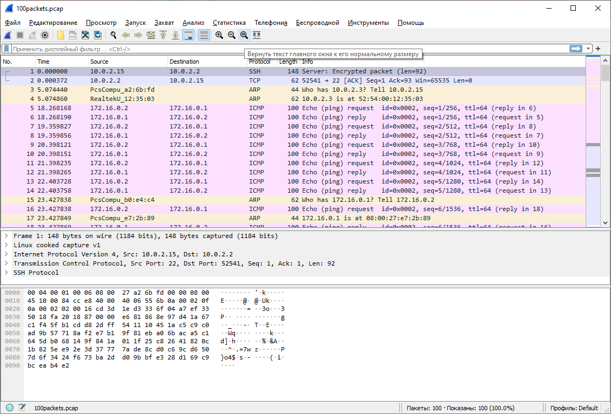

# Домашнее задание к занятию "3.9. Элементы безопасности информационных систем"

1. Установите Bitwarden плагин для браузера. Зарегестрируйтесь и сохраните несколько паролей.


2. Установите Google authenticator на мобильный телефон. Настройте вход в Bitwarden акаунт через Google authenticator OTP.


3. Установите apache2, сгенерируйте самоподписанный сертификат, настройте тестовый сайт для работы по HTTPS.

```bash
$ sudo apt install apache2
```
Для включения модуля ssl в apache:
```bash
$ sudo a2enmod ssl
```
Перезапустим apache
```bash
$ sudo systemctl restart apache2
```
Создание сертификата:

```bash
$ sudo /etc/ssl/certs# openssl req -x509 -nodes -days 365 -newkey rsa:2048 -keyout /etc/ssl/private/apache-selfs
igned.key -out /etc/ssl/certs/apache-selfsigned.crt -subj "/C=RU/ST=Moscow/L=Moscow/O=netology/OU=Org/CN=apache.cert.test"
Generating a RSA private key
......................................+++++
...................................................+++++
writing new private key to '/etc/ssl/private/apache-selfsigned.key'
-----
```
Укажем в файле конфига apache следующие элементы:

```bash
$ sudo vim /etc/apache2/sites-available/default-ssl.conf
```
```
                SSLEngine on
                SSLCertificateFile      /etc/ssl/certs/apache-selfsigned.crt
                SSLCertificateKeyFile /etc/ssl/private/apache-selfsigned.key
```

```bash
sudo a2ensite default-ssl.conf
$ sudo apache2ctl configtest
AH00558: apache2: Could not reliably determine the server's fully qualified domain name, using 10.0.2.15. Set the 'ServerName' directive globally to suppress this message
Syntax OK
```
И перезапустим apache:
```bash
$ sudo systemctl reload apache2
```
Для проверки заходим на поднятый сайт и проверяем сертификат:


4. Проверьте на TLS уязвимости произвольный сайт в интернете (кроме сайтов МВД, ФСБ, МинОбр, НацБанк, РосКосмос, РосАтом, РосНАНО и любых госкомпаний, объектов КИИ, ВПК ... и тому подобное).

```bash
$ ./testssl.sh -U --sneaky https://netology.ru/

...

 Start 2022-09-24 18:33:39        -->> 188.114.99.192:443 (netology.ru) <<--

 Further IP addresses:   188.114.98.192 2a06:98c1:3123:c000:: 2a06:98c1:3122:c000::
 rDNS (188.114.99.192):  --
 Service detected:       HTTP


 Testing vulnerabilities

 Heartbleed (CVE-2014-0160)                not vulnerable (OK), no heartbeat extension
 CCS (CVE-2014-0224)                       not vulnerable (OK)
 Ticketbleed (CVE-2016-9244), experiment.  not vulnerable (OK), no session tickets
 ROBOT                                     not vulnerable (OK)
 Secure Renegotiation (RFC 5746)           OpenSSL handshake didn't succeed
 Secure Client-Initiated Renegotiation     not vulnerable (OK)
 CRIME, TLS (CVE-2012-4929)                not vulnerable (OK)
 BREACH (CVE-2013-3587)                    potentially NOT ok, "gzip" HTTP compression detected. - only supplied "/" tested
                                           Can be ignored for static pages or if no secrets in the page
 POODLE, SSL (CVE-2014-3566)               not vulnerable (OK)
 TLS_FALLBACK_SCSV (RFC 7507)              Downgrade attack prevention supported (OK)
 SWEET32 (CVE-2016-2183, CVE-2016-6329)    VULNERABLE, uses 64 bit block ciphers
 FREAK (CVE-2015-0204)                     not vulnerable (OK)
 DROWN (CVE-2016-0800, CVE-2016-0703)      not vulnerable on this host and port (OK)
                                           make sure you don't use this certificate elsewhere with SSLv2 enabled services, see
                                           https://search.censys.io/search?resource=hosts&virtual_hosts=INCLUDE&q=A3C7D9A8D3805171D99EA61F5C80B8ADF49B93BA21EBB492D78512BA254E90A5
 LOGJAM (CVE-2015-4000), experimental      not vulnerable (OK): no DH EXPORT ciphers, no DH key detected with <= TLS 1.2 BEAST (CVE-2011-3389)                     TLS1: ECDHE-RSA-AES128-SHA AES128-SHA ECDHE-RSA-AES256-SHA AES256-SHA
                                                 DES-CBC3-SHA
                                           VULNERABLE -- but also supports higher protocols  TLSv1.1 TLSv1.2 (likely mitigated)
 LUCKY13 (CVE-2013-0169), experimental     potentially VULNERABLE, uses cipher block chaining (CBC) ciphers with TLS. Check patches
 Winshock (CVE-2014-6321), experimental    not vulnerable (OK)
 RC4 (CVE-2013-2566, CVE-2015-2808)        no RC4 ciphers detected (OK)


 Done 2022-09-24 18:34:10 [  32s] -->> 188.114.99.192:443 (netology.ru) <<--

```

5. Установите на Ubuntu ssh сервер, сгенерируйте новый приватный ключ. Скопируйте свой публичный ключ на другой сервер. Подключитесь к серверу по SSH-ключу.
 
Установка sshd сервера:
```bash
$ sudo apt install openssh-server
$ sudo systemctl start sshd.service
$ sudo systemctl enable sshd.service
```

Генерируем ключи:
```bash
$ ssh-keygen
Generating public/private rsa key pair.
Enter file in which to save the key (/home/vagrant/.ssh/id_rsa):
Enter passphrase (empty for no passphrase):
Enter same passphrase again:
Your identification has been saved in /home/vagrant/.ssh/id_rsa
Your public key has been saved in /home/vagrant/.ssh/id_rsa.pub
The key fingerprint is:
SHA256:8fk2AjdymqOcws30yERXCRBXsaw5Lbv3zEkyLfnGGj8 vagrant@netology1
The key's randomart image is:
+---[RSA 3072]----+
|      oooooo     |
|       . .o.     |
|        ..o      |
|      . .* .     |
|     . .S B      |
|      o  @ =     |
|   . * o= B.*    |
|    o.=o.o.&Eo   |
|     .+ ...+B.   |
+----[SHA256]-----+
```
Копируем публичный ключ на удаленный сервер:

```bash
$ ssh-copy-id vagrant@172.16.0.2
```

Для подключения используем:

```bash
$ ssh vagrant@172.16.0.2
```

6. Переименуйте файлы ключей из задания 5. Настройте файл конфигурации SSH клиента, так чтобы вход на удаленный сервер осуществлялся по имени сервера.

По умолчанию файлы ключей создаются в директории `~/.ssh`. Переименуем ключи командой `mv`:

```bash
$ mv id_rsa id_rsa_172.16.0.2
$ mv id_rsa.pub id_rsa_172.16.0.2.pub
```
Создадим файл конфигурации ssh `~/.ssh/config`
```bash
$ mkdir -p ~/ssh $$ chmod 700 ~/.ssh
$ touch ~/.ssh/config && chomd 600 ~/.ssh/config
$ vim ~/.ssh/config
```
```
Host sshTest
    HostName 172.16.0.2
    IdentityFile ~/.ssh/id_rsa_172.16.0.2
    User vagrant
```
Проверяем:

```bash
$ ssh sshTest
Welcome to Ubuntu 20.04.4 LTS (GNU/Linux 5.4.0-110-generic x86_64)

 * Documentation:  https://help.ubuntu.com
 * Management:     https://landscape.canonical.com
 * Support:        https://ubuntu.com/advantage

  System information as of Sat 24 Sep 2022 07:16:20 PM UTC

  System load:  0.0                Processes:             118
  Usage of /:   11.7% of 30.63GB   Users logged in:       1
  Memory usage: 22%                IPv4 address for eth0: 10.0.2.15
  Swap usage:   0%                 IPv4 address for eth1: 172.16.0.2


This system is built by the Bento project by Chef Software
More information can be found at https://github.com/chef/bento
Last login: Sat Sep 24 19:00:58 2022 from 172.16.0.1
```

7. Соберите дамп трафика утилитой tcpdump в формате pcap, 100 пакетов. Откройте файл pcap в Wireshark.

```bash
$ sudo tcpdump -ni any -c 100 -w 100packets.pcap
```



 ---
## Задание для самостоятельной отработки (необязательно к выполнению)

8*. Просканируйте хост scanme.nmap.org. Какие сервисы запущены?

```bash
$ nmap -F scanme.nmap.org
Starting Nmap 7.80 ( https://nmap.org ) at 2022-09-24 19:39 UTC
Nmap scan report for scanme.nmap.org (45.33.32.156)
Host is up (0.23s latency).
Other addresses for scanme.nmap.org (not scanned): 2600:3c01::f03c:91ff:fe18:bb2f
Not shown: 98 filtered ports
PORT   STATE SERVICE
22/tcp open  ssh
80/tcp open  http

Nmap done: 1 IP address (1 host up) scanned in 7.80 seconds
```
Запущен ssh и web сервера.

9*. Установите и настройте фаервол ufw на web-сервер из задания 3. Откройте доступ снаружи только к портам 22,80,443

```bash
$ sudo ufw allow ssh/tcp
Rules updated
Rules updated (v6)
$ sudo ufw allow http/tcp
Rules updated
Rules updated (v6)
$ sudo ufw allow https/tcp
Rules updated
Rules updated (v6)
$ sudo ufw status
Status: active

To                         Action      From
--                         ------      ----
22/tcp                     ALLOW       Anywhere
80/tcp                     ALLOW       Anywhere
443/tcp                    ALLOW       Anywhere
22/tcp (v6)                ALLOW       Anywhere (v6)
80/tcp (v6)                ALLOW       Anywhere (v6)
443/tcp (v6)               ALLOW       Anywhere (v6)
```
