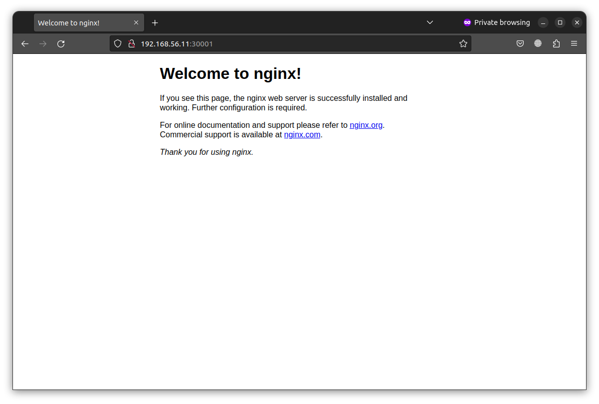

# Домашнее задание к занятию «Сетевое взаимодействие в K8S. Часть 1»

### Цель задания

В тестовой среде Kubernetes необходимо обеспечить доступ к приложению, установленному в предыдущем ДЗ и состоящему из двух контейнеров, по разным портам в разные контейнеры как внутри кластера, так и снаружи.

------

### Чеклист готовности к домашнему заданию

1. Установленное k8s-решение (например, MicroK8S).
2. Установленный локальный kubectl.
3. Редактор YAML-файлов с подключённым Git-репозиторием.

------

### Инструменты и дополнительные материалы, которые пригодятся для выполнения задания

1. [Описание](https://kubernetes.io/docs/concepts/workloads/controllers/deployment/) Deployment и примеры манифестов.
2. [Описание](https://kubernetes.io/docs/concepts/services-networking/service/) Описание Service.
3. [Описание](https://github.com/wbitt/Network-MultiTool) Multitool.

------

### Задание 1. Создать Deployment и обеспечить доступ к контейнерам приложения по разным портам из другого Pod внутри кластера

1. Создать Deployment приложения, состоящего из двух контейнеров (nginx и multitool), с количеством реплик 3 шт.

<details> <summary> Манифест:</summary>

```yaml
apiVersion: apps/v1
kind: Deployment
metadata:
  name: task1
  labels:
    app: nginx
spec:
  replicas: 3
  selector:
    matchLabels:
      app: nginx
  template:
    metadata:
      labels:
        app: nginx
    spec:
      containers:
      - name: nginx
        image: nginx:1.14.2
        ports:
        - containerPort: 80
      - name: multitool
        image: wbitt/network-multitool:alpine-extra
        env:
        - name: HTTP_PORT
          value: "8080"
        ports:
        - containerPort: 8080
```

</details>

2. Создать Service, который обеспечит доступ внутри кластера до контейнеров приложения из п.1 по порту 9001 — nginx 80, по 9002 — multitool 8080.

<details> <summary> Манифест:</summary>

```yaml
apiVersion: v1
kind: Service
metadata:
  name: task1-svc
spec:
  selector:
    app: nginx
  ports:
  - name: nginx
    port: 9001
    protocol: TCP
    targetPort: 80
  - name: multitool
    port: 9002
    protocol: TCP
    targetPort: 8080
  type: ClusterIP
```
</details>

3. Создать отдельный Pod с приложением multitool и убедиться с помощью `curl`, что из пода есть доступ до приложения из п.1 по разным портам в разные контейнеры.

```bash
$ kubectl get svc
NAME         TYPE        CLUSTER-IP       EXTERNAL-IP   PORT(S)             AGE
kubernetes   ClusterIP   10.152.183.1     <none>        443/TCP             4d4h
task1-svc    ClusterIP   10.152.183.195   <none>        9001/TCP,9002/TCP   44s
$ kubectl exec multitool -- curl 10.152.183.195:9001
  % Total    % Received % Xferd  Average Speed   Time    Time     Time  Current
                                 Dload  Upload   Total   Spent    Left  Speed
  0     0    0     0    0     0      0      0 --:--:-- --:--:-- --:--:--     0<!DOCTYPE html>
<html>
<head>
<title>Welcome to nginx!</title>
<style>
    body {
        width: 35em;
        margin: 0 auto;
        font-family: Tahoma, Verdana, Arial, sans-serif;
    }
</style>
</head>
<body>
<h1>Welcome to nginx!</h1>
<p>If you see this page, the nginx web server is successfully installed and
working. Further configuration is required.</p>

<p>For online documentation and support please refer to
<a href="http://nginx.org/">nginx.org</a>.<br/>
Commercial support is available at
<a href="http://nginx.com/">nginx.com</a>.</p>

<p><em>Thank you for using nginx.</em></p>
</body>
</html>
100   612  100   612    0     0  51952      0 --:--:-- --:--:-- --:--:-- 55636
$ kubectl exec multitool -- curl 10.152.183.195:9002
  % Total    % Received % Xferd  Average Speed   Time    Time     Time  Current
                                 Dload  Upload   Total   Spent    Left  Speed
  0     0    0     0    0     0      0      0 --:--:-- --:--:-- --:--:--     0WBITT Network MultiTool (with NGINX) - task1-65958d99b4-t6lzv - 10.1.116.148 . (Formerly praqma/network-multitool)
100   115  100   115    0     0  59927      0 --:--:-- --:--:-- --:--:--  112k
```

4. Продемонстрировать доступ с помощью `curl` по доменному имени сервиса.

Доменное имя кластера: `task1-svc.default.svc.cluster.local`

```bash
$ kubectl exec multitool -- curl task1-svc.default.svc.cluster.local:9001
  % Total    % Received % Xferd  Average Speed   Time    Time     Time  Current
                                 Dload  Upload   Total   Spent    Left  Speed
  0     0    0     0    0     0      0      0 --:--:-- --:--:-- --:--:--     0<!DOCTYPE html>
<html>
<head>
<title>Welcome to nginx!</title>
<style>
    body {
        width: 35em;
        margin: 0 auto;
        font-family: Tahoma, Verdana, Arial, sans-serif;
    }
</style>
</head>
<body>
<h1>Welcome to nginx!</h1>
<p>If you see this page, the nginx web server is successfully installed and
working. Further configuration is required.</p>

<p>For online documentation and support please refer to
<a href="http://nginx.org/">nginx.org</a>.<br/>
Commercial support is available at
<a href="http://nginx.com/">nginx.com</a>.</p>

<p><em>Thank you for using nginx.</em></p>
</body>
</html>
100   612  100   612    0     0   3945      0 --:--:-- --:--:-- --:--:--  3923
$ kubectl exec multitool -- curl task1-svc.default.svc.cluster.local:9002
  % Total    % Received % Xferd  Average Speed   Time    Time     Time  Current
                                 Dload  Upload   Total   Spent    Left  Speed
  0     0    0     0    0     0      0      0 --:--:-- --:--:-- --:--:--     0WBITT Network MultiTool (with NGINX) - task1-65958d99b4-btl4s - 10.1.116.147 . (Formerly praqma/network-multitool)
100   115  100   115    0     0  20743      0 --:--:-- --:--:-- --:--:-- 23000
```

5. Предоставить манифесты [Deployment](./data/nginx_plus_multitool.yaml) и [Service](./data/Service1.yaml) в решении, а также скриншоты или вывод команды п.4.

------

### Задание 2. Создать Service и обеспечить доступ к приложениям снаружи кластера

1. Создать отдельный Service приложения из Задания 1 с возможностью доступа снаружи кластера к nginx, используя тип NodePort.

<details> <summary> Манифест:</summary>

```yaml
apiVersion: v1
kind: Service
metadata:
  name: task1-svc
spec:
  selector:
    app: nginx
  ports:
  - name: nginx
    nodePort: 30001
    protocol: TCP
    port: 80
  - name: multitool
    nodePort: 30002
    protocol: TCP
    port: 8080
  type: NodePort
```
</details>

2. Продемонстрировать доступ с помощью браузера или `curl` с локального компьютера.




3. Предоставить манифест и [Service](./data/Service2.yaml) в решении, а также скриншоты или вывод команды п.2.

------

### Правила приёма работы

1. Домашняя работа оформляется в своем Git-репозитории в файле README.md. Выполненное домашнее задание пришлите ссылкой на .md-файл в вашем репозитории.
2. Файл README.md должен содержать скриншоты вывода необходимых команд `kubectl` и скриншоты результатов.
3. Репозиторий должен содержать тексты манифестов или ссылки на них в файле README.md.

