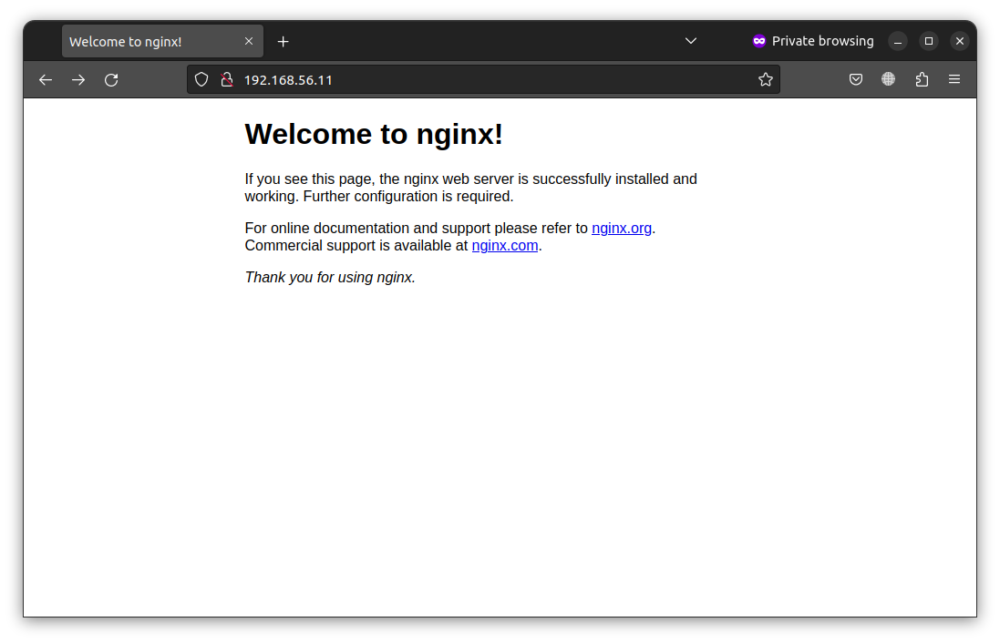
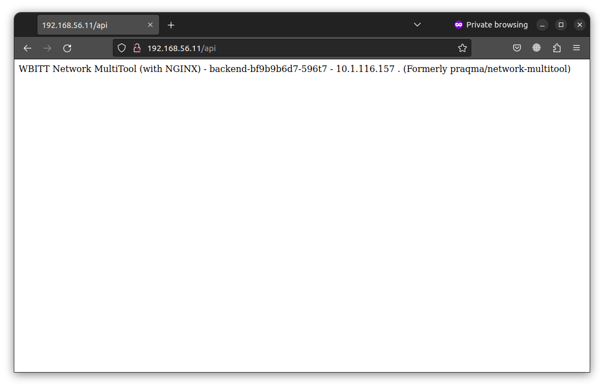

# Домашнее задание к занятию «Сетевое взаимодействие в K8S. Часть 2»

### Цель задания

В тестовой среде Kubernetes необходимо обеспечить доступ к двум приложениям снаружи кластера по разным путям.

------

### Чеклист готовности к домашнему заданию

1. Установленное k8s-решение (например, MicroK8S).
2. Установленный локальный kubectl.
3. Редактор YAML-файлов с подключённым Git-репозиторием.

------

### Инструменты и дополнительные материалы, которые пригодятся для выполнения задания

1. [Инструкция](https://microk8s.io/docs/getting-started) по установке MicroK8S.
2. [Описание](https://kubernetes.io/docs/concepts/services-networking/service/) Service.
3. [Описание](https://kubernetes.io/docs/concepts/services-networking/ingress/) Ingress.
4. [Описание](https://github.com/wbitt/Network-MultiTool) Multitool.

------

### Задание 1. Создать Deployment приложений backend и frontend

1. Создать Deployment приложения _frontend_ из образа nginx с количеством реплик 3 шт.

```yaml
apiVersion: apps/v1
kind: Deployment
metadata:
  name: frontend
spec:
  replicas: 3
  selector:
    matchLabels:
      nginx: frontend
  template:
    metadata:
      labels:
        nginx: frontend
    spec:
      containers:
      - name: nginx
        image: nginx:1.14.2
        ports:
        - name: nginx-web
          containerPort: 80
```

2. Создать Deployment приложения _backend_ из образа multitool.

```yaml
apiVersion: apps/v1
kind: Deployment
metadata:
  name: backend
spec:
  replicas: 1
  selector:
    matchLabels:
      multitool: backend
  template:
    metadata:
      labels:
        multitool: backend
    spec:
      containers:
      - name: backend
        image: wbitt/network-multitool:alpine-extra
        env:
        - name: HTTP_PORT
          value: "8080"
        ports:
        - name: multitool-web          
          containerPort: 8080
```

3. Добавить Service, которые обеспечат доступ к обоим приложениям внутри кластера. 

frontend Service:
```yaml
apiVersion: v1
kind: Service
metadata:
  name: frontend-svc
spec:
  selector:
    nginx: frontend
  ports:
  - name: frontend
    port: 80
    protocol: TCP
    targetPort: 80
  type: ClusterIP
```

backend Service:
```yaml
apiVersion: v1
kind: Service
metadata:
  name: backend-svc
spec:
  selector:
    multitool: backend
  ports:
  - name: backend
    port: 8080
    protocol: TCP
    targetPort: 8080
  type: ClusterIP
```

Промежуточный результат:
```bash
$ kubectl get pods
NAME                       READY   STATUS    RESTARTS   AGE
backend-bf9b9b6d7-596t7    1/1     Running   0          22s
frontend-7bb8b4c9b-p4klk   1/1     Running   0          10s
frontend-7bb8b4c9b-2d9ms   1/1     Running   0          10s
frontend-7bb8b4c9b-5g6wz   1/1     Running   0          10s
$ kubectl get svc
NAME           TYPE        CLUSTER-IP       EXTERNAL-IP   PORT(S)    AGE
kubernetes     ClusterIP   10.152.183.1     <none>        443/TCP    6d23h
backend-svc    ClusterIP   10.152.183.148   <none>        8080/TCP   19s
frontend-svc   ClusterIP   10.152.183.145   <none>        80/TCP     9s
```

4. Продемонстрировать, что приложения видят друг друга с помощью Service.

```bash
$ kubectl exec backend-bf9b9b6d7-596t7 -- curl frontend-svc.default.svc.cluster.local
  % Total    % Received % Xferd  Average Speed   Time    Time     Time  Current
                                 Dload  Upload   Total   Spent    Left  Speed
  0     0    0     0    0     0      0      0 --:--:-- --:--:-- --:--:--     0<!DOCTYPE html>
<html>
<head>
<title>Welcome to nginx!</title>
<style>
    body {
        width: 35em;
        margin: 0 auto;
        font-family: Tahoma, Verdana, Arial, sans-serif;
    }
</style>
</head>
<body>
<h1>Welcome to nginx!</h1>
<p>If you see this page, the nginx web server is successfully installed and
working. Further configuration is required.</p>

<p>For online documentation and support please refer to
<a href="http://nginx.org/">nginx.org</a>.<br/>
Commercial support is available at
<a href="http://nginx.com/">nginx.com</a>.</p>

<p><em>Thank you for using nginx.</em></p>
</body>
</html>
100   612  100   612    0     0   2088      0 --:--:-- --:--:-- --:--:--  2095
```

5. Предоставить манифесты Deployment и Service в решении, а также скриншоты или вывод команды п.4.

------

### Задание 2. Создать Ingress и обеспечить доступ к приложениям снаружи кластера

1. Включить Ingress-controller в MicroK8S.

```bash
$ microk8s enable ingress
Infer repository core for addon ingress
Enabling Ingress
ingressclass.networking.k8s.io/public created
ingressclass.networking.k8s.io/nginx created
namespace/ingress created
serviceaccount/nginx-ingress-microk8s-serviceaccount created
clusterrole.rbac.authorization.k8s.io/nginx-ingress-microk8s-clusterrole created
role.rbac.authorization.k8s.io/nginx-ingress-microk8s-role created
clusterrolebinding.rbac.authorization.k8s.io/nginx-ingress-microk8s created
rolebinding.rbac.authorization.k8s.io/nginx-ingress-microk8s created
configmap/nginx-load-balancer-microk8s-conf created
configmap/nginx-ingress-tcp-microk8s-conf created
configmap/nginx-ingress-udp-microk8s-conf created
daemonset.apps/nginx-ingress-microk8s-controller created
Ingress is enabled
```

2. Создать Ingress, обеспечивающий доступ снаружи по IP-адресу кластера MicroK8S так, чтобы при запросе только по адресу открывался _frontend_ а при добавлении /api - _backend_.

```yaml
apiVersion: networking.k8s.io/v1
kind: Ingress
metadata:
  name: ingress
  annotations:
    nginx.ingress.kubernetes.io/rewrite-target: /
spec:
  rules:
  - http:
      paths:
      - path: /
        pathType: Prefix
        backend:
          service:
            name: frontend-svc
            port:
              name: frontend
      - path: /api
        pathType: Prefix
        backend:
          service:
            name: backend-svc
            port:
              name: backend
```

3. Продемонстрировать доступ с помощью браузера или `curl` с локального компьютера.





4. Предоставить манифесты и скриншоты или вывод команды п.2.

------

### Правила приема работы

1. Домашняя работа оформляется в своем Git-репозитории в файле README.md. Выполненное домашнее задание пришлите ссылкой на .md-файл в вашем репозитории.
2. Файл README.md должен содержать скриншоты вывода необходимых команд `kubectl` и скриншоты результатов.
3. Репозиторий должен содержать тексты манифестов или ссылки на них в файле README.md.

------
