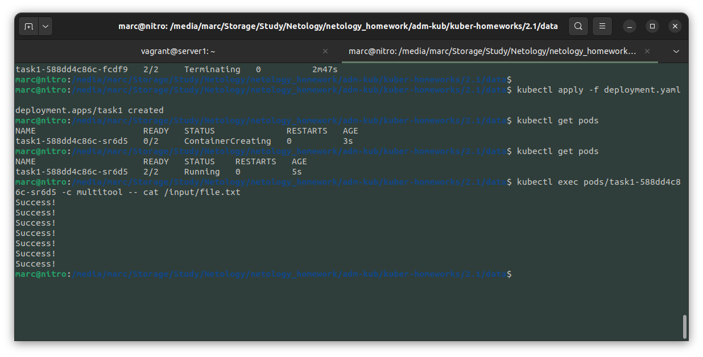
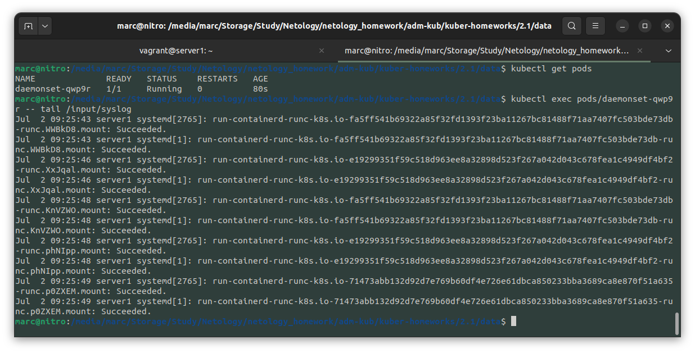

# Домашнее задание к занятию «Хранение в K8s. Часть 1»

### Цель задания

В тестовой среде Kubernetes нужно обеспечить обмен файлами между контейнерам пода и доступ к логам ноды.

------

### Чеклист готовности к домашнему заданию

1. Установленное K8s-решение (например, MicroK8S).
2. Установленный локальный kubectl.
3. Редактор YAML-файлов с подключенным GitHub-репозиторием.

------

### Дополнительные материалы для выполнения задания

1. [Инструкция по установке MicroK8S](https://microk8s.io/docs/getting-started).
2. [Описание Volumes](https://kubernetes.io/docs/concepts/storage/volumes/).
3. [Описание Multitool](https://github.com/wbitt/Network-MultiTool).

------

### Задание 1 

**Что нужно сделать**

Создать Deployment приложения, состоящего из двух контейнеров и обменивающихся данными.

1. Создать Deployment приложения, состоящего из контейнеров busybox и multitool.

```yaml
apiVersion: apps/v1
kind: Deployment
metadata:
  name: task1
  labels:
    busybox: multitool
spec:
  replicas: 1
  selector:
    matchLabels:
      busybox: multitool
  template:
    metadata:
      labels:
        busybox: multitool
    spec:
      containers:
      - name: busybox
        image: busybox:1.36.1
        command: ['sh', '-c', 'while true; do echo Success! >> /output/file.txt; sleep 5; done']
        volumeMounts:
        - name: netology
          mountPath: /output
      - name: multitool
        image: wbitt/network-multitool:alpine-extra
        env:
        - name: HTTP_PORT
          value: "8080"
        volumeMounts:
        - name: netology
          mountPath: /input
      volumes:
      - name: netology
        emptyDir: {}
```

2. Сделать так, чтобы busybox писал каждые пять секунд в некий файл в общей директории.

```yaml
command: ['sh', '-c', 'while true; do echo Success! >> /output/file.txt; sleep 5; done']
```

3. Обеспечить возможность чтения файла контейнером multitool.
4. Продемонстрировать, что multitool может читать файл, который периодоически обновляется.

```bash
$ kubectl exec pods/task1-588dd4c86c-sr6d5 -c multitool -- cat /input/file.txt
Success!
Success!
Success!
Success!
Success!
Success!
Success!
```

5. Предоставить манифесты Deployment в решении, а также скриншоты или вывод команды из п. 4.

<details> <summary> Манифест:</summary>

```yaml
apiVersion: apps/v1
kind: Deployment
metadata:
  name: task1
  labels:
    busybox: multitool
spec:
  replicas: 1
  selector:
    matchLabels:
      busybox: multitool
  template:
    metadata:
      labels:
        busybox: multitool
    spec:
      containers:
      - name: busybox
        image: busybox:1.36.1
        command: ['sh', '-c', 'while true; do echo Success! >> /output/file.txt; sleep 5; done']
        volumeMounts:
        - name: netology
          mountPath: /output
      - name: multitool
        image: wbitt/network-multitool:alpine-extra
        env:
        - name: HTTP_PORT
          value: "8080"
        volumeMounts:
        - name: netology
          mountPath: /input
      volumes:
      - name: netology
        emptyDir: {}
```

</details>



------

### Задание 2

**Что нужно сделать**

Создать DaemonSet приложения, которое может прочитать логи ноды.

1. Создать DaemonSet приложения, состоящего из multitool.

```yaml
apiVersion: apps/v1
kind: DaemonSet
metadata:
  name: daemonset
spec:
  selector:
    matchLabels:
      app: multitool
  template:
    metadata:
      labels:
        app: multitool
    spec:
      containers:
      - name: multitool
        image: wbitt/network-multitool:alpine-extra
        volumeMounts:
        - name: microk8s-logs
          mountPath: /input
      volumes:
      - name: microk8s-logs
        hostPath:
          path: /var/log
```

2. Обеспечить возможность чтения файла `/var/log/syslog` кластера MicroK8S.
3. Продемонстрировать возможность чтения файла изнутри пода.

```bash
$ kubectl get pods
NAME              READY   STATUS    RESTARTS   AGE
daemonset-qwp9r   1/1     Running   0          80s
$ kubectl exec pods/daemonset-qwp9r -- tail /input/syslog
Jul  2 09:25:43 server1 systemd[2765]: run-containerd-runc-k8s.io-fa5ff541b69322a85f32fd1393f23ba11267bc81488f71aa7407fc503bde73db-runc.WWBkD8.mount: Succeeded.
Jul  2 09:25:43 server1 systemd[1]: run-containerd-runc-k8s.io-fa5ff541b69322a85f32fd1393f23ba11267bc81488f71aa7407fc503bde73db-runc.WWBkD8.mount: Succeeded.
Jul  2 09:25:46 server1 systemd[2765]: run-containerd-runc-k8s.io-e19299351f59c518d963ee8a32898d523f267a042d043c678fea1c4949df4bf2-runc.XxJqal.mount: Succeeded.
Jul  2 09:25:46 server1 systemd[1]: run-containerd-runc-k8s.io-e19299351f59c518d963ee8a32898d523f267a042d043c678fea1c4949df4bf2-runc.XxJqal.mount: Succeeded.
Jul  2 09:25:48 server1 systemd[2765]: run-containerd-runc-k8s.io-fa5ff541b69322a85f32fd1393f23ba11267bc81488f71aa7407fc503bde73db-runc.KnVZWO.mount: Succeeded.
Jul  2 09:25:48 server1 systemd[1]: run-containerd-runc-k8s.io-fa5ff541b69322a85f32fd1393f23ba11267bc81488f71aa7407fc503bde73db-runc.KnVZWO.mount: Succeeded.
Jul  2 09:25:48 server1 systemd[2765]: run-containerd-runc-k8s.io-e19299351f59c518d963ee8a32898d523f267a042d043c678fea1c4949df4bf2-runc.phNIpp.mount: Succeeded.
Jul  2 09:25:48 server1 systemd[1]: run-containerd-runc-k8s.io-e19299351f59c518d963ee8a32898d523f267a042d043c678fea1c4949df4bf2-runc.phNIpp.mount: Succeeded.
Jul  2 09:25:49 server1 systemd[2765]: run-containerd-runc-k8s.io-71473abb132d92d7e769b60df4e726e61dbca850233bba3689ca8e870f51a635-runc.p0ZXEM.mount: Succeeded.
Jul  2 09:25:49 server1 systemd[1]: run-containerd-runc-k8s.io-71473abb132d92d7e769b60df4e726e61dbca850233bba3689ca8e870f51a635-runc.p0ZXEM.mount: Succeeded.
```

4. Предоставить манифесты Deployment, а также скриншоты или вывод команды из п. 2.

<details> <summary> Манифест:</summary>

```yaml
apiVersion: apps/v1
kind: DaemonSet
metadata:
  name: daemonset
spec:
  selector:
    matchLabels:
      app: multitool
  template:
    metadata:
      labels:
        app: multitool
    spec:
      containers:
      - name: multitool
        image: wbitt/network-multitool:alpine-extra
        volumeMounts:
        - name: microk8s-logs
          mountPath: /input
      volumes:
      - name: microk8s-logs
        hostPath:
          path: /var/log
```

</details>



------

### Правила приёма работы

1. Домашняя работа оформляется в своём Git-репозитории в файле README.md. Выполненное задание пришлите ссылкой на .md-файл в вашем репозитории.
2. Файл README.md должен содержать скриншоты вывода необходимых команд `kubectl`, а также скриншоты результатов.
3. Репозиторий должен содержать тексты манифестов или ссылки на них в файле README.md.

------
