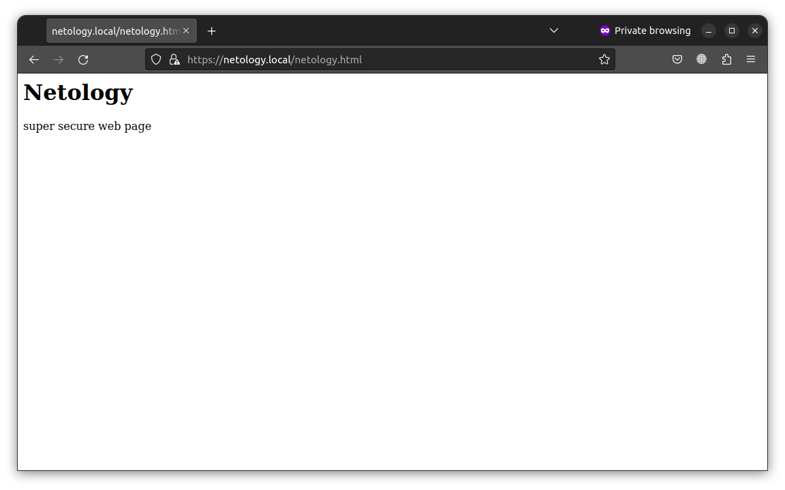
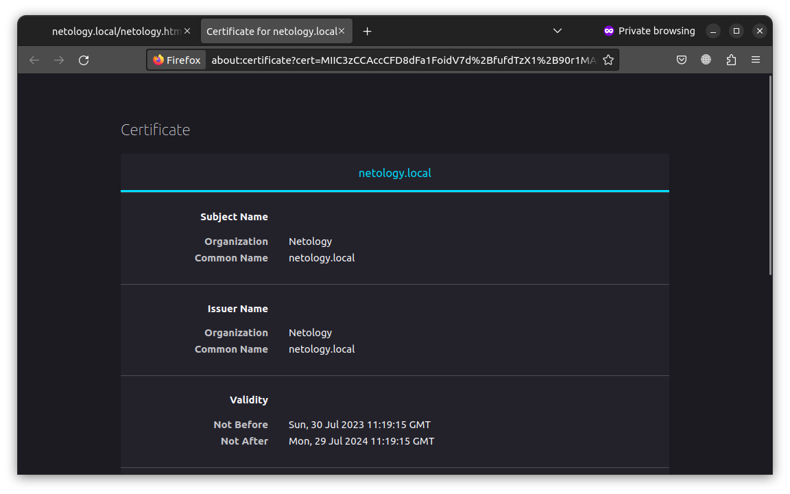

# Домашнее задание к занятию «Конфигурация приложений»

### Цель задания

В тестовой среде Kubernetes необходимо создать конфигурацию и продемонстрировать работу приложения.

------

### Чеклист готовности к домашнему заданию

1. Установленное K8s-решение (например, MicroK8s).
2. Установленный локальный kubectl.
3. Редактор YAML-файлов с подключённым GitHub-репозиторием.

------

### Инструменты и дополнительные материалы, которые пригодятся для выполнения задания

1. [Описание](https://kubernetes.io/docs/concepts/configuration/secret/) Secret.
2. [Описание](https://kubernetes.io/docs/concepts/configuration/configmap/) ConfigMap.
3. [Описание](https://github.com/wbitt/Network-MultiTool) Multitool.

------

### Задание 1. Создать Deployment приложения и решить возникшую проблему с помощью ConfigMap. Добавить веб-страницу

1. Создать Deployment приложения, состоящего из контейнеров nginx и multitool.

```bash
$ kubectl create namespace ns1
```

```yaml
apiVersion: apps/v1
kind: Deployment
metadata:
  name: task1
  labels:
    nginx: multitool
  namespace: ns1
spec:
  selector:
    matchLabels:
      nginx: multitool
  template:
    metadata:
      labels:
        nginx: multitool
    spec:
      containers:
      - name: nginx
        image: nginx:1.14.2
        ports:
        - containerPort: 80
      - name: multitool
        image: wbitt/network-multitool:alpine-extra
        env:
        - name: HTTP_PORT
          valueFrom:
            configMapKeyRef:
              name: configmap1
              key: HTTP_PORT
        ports:
        - containerPort: 8080
```

2. Решить возникшую проблему с помощью ConfigMap.

```yaml
apiVersion: v1
kind: ConfigMap
metadata:
  name: configmap1
  namespace: ns1
data:
  HTTP_PORT: "8080"
```

3. Продемонстрировать, что pod стартовал и оба конейнера работают.

```bash
$ kubectl get pods -n ns1 
NAME                     READY   STATUS    RESTARTS   AGE
task1-568895cb48-7jrgh   2/2     Running   0          7m19s
```

4. Сделать простую веб-страницу и подключить её к Nginx с помощью ConfigMap. Подключить Service и показать вывод curl или в браузере.

ConfigMap:
```yaml
apiVersion: v1
kind: ConfigMap
metadata:
  name: configmap1
  namespace: ns1
data:
  HTTP_PORT: "8080"
  netology.html: |
    <h1>Netology</h1>
    <p>some text</p>
```

Service:
```yaml
apiVersion: v1
kind: Service
metadata:
  name: task1
  namespace: ns1
spec:
  selector:
    nginx: multitool
  ports:
  - name: nginx
    port: 80
    protocol: TCP
    targetPort: 80
  - name: multitool
    port: 8080
    protocol: TCP
    targetPort: 8080
  type: ClusterIP
```

```bash
$ kubectl get -n ns1 svc/task1 
NAME    TYPE        CLUSTER-IP      EXTERNAL-IP   PORT(S)           AGE
task1   ClusterIP   10.152.183.61   <none>        80/TCP,8080/TCP   2m52s
```

Ответ:

```bash
$ curl 10.152.183.61/netology.html
<h1>Netology</h1>
<p>some text</p>
```

Доработка (Обращее по доменному имени):

```bash
$ curl task1.ns1.svc.cluster.local/netology.html
<h1>Netology</h1>
<p>some text</p>
```

5. Предоставить манифесты, а также скриншоты или вывод необходимых команд.

* [Deployment](./data/deployment1.yaml)
* [ConfigMap](./data/configMap1.yaml)
* [Service](./data/service1.yaml)


------

### Задание 2. Создать приложение с вашей веб-страницей, доступной по HTTPS 

1. Создать Deployment приложения, состоящего из Nginx.

Deployment:

```yaml
apiVersion: apps/v1
kind: Deployment
metadata:
  name: task2
  labels:
    app: nginx
  namespace: ns2
spec:
  selector:
    matchLabels:
      app: nginx
  template:
    metadata:
      labels:
        app: nginx
    spec:
      containers:
      - name: nginx
        image: nginx:1.14.2
        volumeMounts:
        - name: configmap-volume
          mountPath: /usr/share/nginx/html/
        ports:
        - containerPort: 443
      volumes:
      - name: configmap-volume
        configMap:
          name: configmap2
```

2. Создать собственную веб-страницу и подключить её как ConfigMap к приложению.

ConfigMap:

```yaml
apiVersion: v1
kind: ConfigMap
metadata:
  name: configmap2
  namespace: ns2
data:
  netology.html: |
    <h1>Netology</h1>
    <p>super secure web page</p>
```

3. Выпустить самоподписной сертификат SSL. Создать Secret для использования сертификата.

openssl.conf:
```
[req]
default_bits = 2048
distinguished_name = req_distinguished_name
req_extensions = req_ext
prompt = no

[req_distinguished_name]
organizationName = Netology
commonName = netology.local

[req_ext]
subjectAltName = @alt_names

[alt_names]
DNS.1  = netology.local
```

```bash
$ openssl req -x509 -newkey rsa:2048 -nodes -keyout private.key -out cert.crt -config openssl.conf -sha256 -days 365
```

Secret:

```yaml
apiVersion: v1
kind: Secret
metadata:
  name: secret2
  namespace: ns2
type: kubernetes.io/tls
data:
  tls.crt: |
     cert base64
  tls.key: |
     key base64
```

4. Создать Ingress и необходимый Service, подключить к нему SSL в вид. Продемонстировать доступ к приложению по HTTPS. 

Ingress:

```yaml
apiVersion: networking.k8s.io/v1
kind: Ingress
metadata:
  name: ingress
  namespace: ns2
spec:
  ingressClassName: nginx
  tls:
    - hosts:
      - netology.local
      secretName: secret2
  rules:
  - host: netology.local
    http:
      paths:
      - path: /
        pathType: Prefix
        backend:
          service:
            name: nginx-service
            port:
              name: nginx
```

Host file:

```bash
$ cat /etc/hosts
127.0.0.1	localhost
127.0.1.1	nitro
192.168.56.11   netology.local
```

Service:

```yaml
apiVersion: v1
kind: Service
metadata:
  name: nginx-service
  namespace: ns2
spec:
  selector:
    app: nginx
  ports:
  - name: nginx
    port: 80
    protocol: TCP
    targetPort: 80
  type: ClusterIP
```

5. Предоставить манифесты, а также скриншоты или вывод необходимых команд.





------

### Правила приёма работы

1. Домашняя работа оформляется в своём GitHub-репозитории в файле README.md. Выполненное домашнее задание пришлите ссылкой на .md-файл в вашем репозитории.
2. Файл README.md должен содержать скриншоты вывода необходимых команд `kubectl`, а также скриншоты результатов.
3. Репозиторий должен содержать тексты манифестов или ссылки на них в файле README.md.

------
