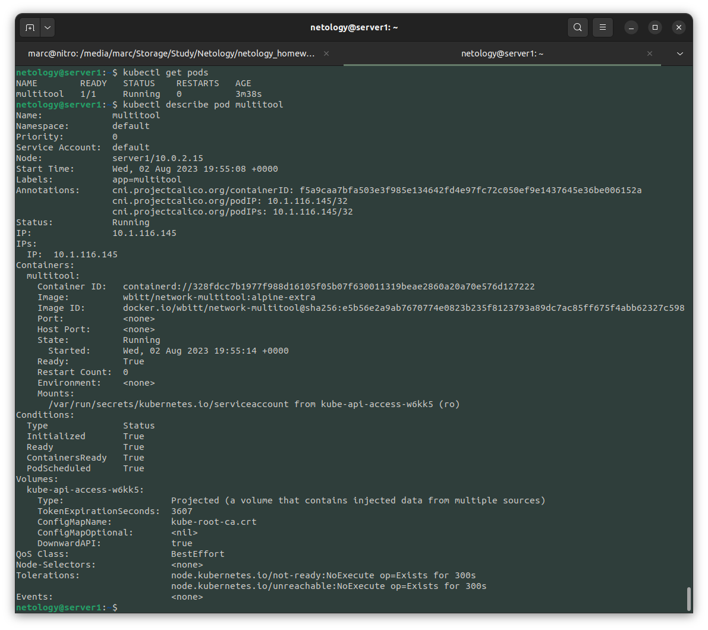

# Домашнее задание к занятию «Управление доступом»

### Цель задания

В тестовой среде Kubernetes нужно предоставить ограниченный доступ пользователю.

------

### Чеклист готовности к домашнему заданию

1. Установлено k8s-решение, например MicroK8S.
2. Установленный локальный kubectl.
3. Редактор YAML-файлов с подключённым github-репозиторием.

------

### Инструменты / дополнительные материалы, которые пригодятся для выполнения задания

1. [Описание](https://kubernetes.io/docs/reference/access-authn-authz/rbac/) RBAC.
2. [Пользователи и авторизация RBAC в Kubernetes](https://habr.com/ru/company/flant/blog/470503/).
3. [RBAC with Kubernetes in Minikube](https://medium.com/@HoussemDellai/rbac-with-kubernetes-in-minikube-4deed658ea7b).

------

### Задание 1. Создайте конфигурацию для подключения пользователя

1. Создайте и подпишите SSL-сертификат для подключения к кластеру.

Создадим тестового пользователя `netology`:
```bash
# useradd netology -m -s /bin/bash
```

Перейдем в его домашнюю папку и создадим каталог для хранения ключа и сертификата пользователя:
```bash
# cd /home/netology
# mkdir .certs
# cd .certs
```

Создадим закрытый ключ:
```bash
# openssl genrsa -out netology.key 2048
```

Создадим запрос на подпись сертификата:
```bash
# openssl req -new -key netology.key -out netology.csr -subj "/CN=netology"
```

Подпишем запрос на сертификат ключем кубернетес кластера:
```bash
# openssl x509 -req -in netology.csr -CA /var/snap/microk8s/current/certs/ca.crt -CAkey /var/snap/microk8s/current/certs/ca.key -CAcreateserial -out netology.crt -days 365
```

2. Настройте конфигурационный файл kubectl для подключения.

Создадим пользователя в кубернетес кластере:

```bash
$ kubectl config set-credentials netology --client-certificate=/home/netology/.certs/netology.crt --client-key=/home/netology/.certs/netology.key 
User "netology" set.
```

Создадим контекс польздователя:

```bash
$ kubectl config set-context netology-context --cluster=microk8s-cluster --user=netology
Context "netology-context" created.
```

Добавим в файл конфигурации для пользователя `netology` `/home/netology/.kube/config` kubernetes server и сертификат сервера:

```
apiVersion: v1
clusters:
- cluster:
    certificate-authority-data: DATA+OMITTED
    server: https://192.168.56.11:16443
  name: microk8s-cluster
contexts:
- context:
    cluster: microk8s-cluster
    user: netology
  name: netology-context
current-context: netology-context
kind: Config
preferences: {}
users:
- name: netology
  user:
    client-certificate: /home/netology/.certs/netology.crt
    client-key: /home/netology/.certs/netology.key
```

Залогинемся под пользователем `netology` и переключимся на контекст пользователя:

```bash
# su netology
$ kubectl config use-context netology-context
Switched to context "netology-context".
```

Проверим права пользователя:

```bash
$ kubectl get pods
Error from server (Forbidden): pods is forbidden: User "netology" cannot list resource "pods" in API group "" in the namespace "default"
$ kubectl get nodes
Error from server (Forbidden): nodes is forbidden: User "netology" cannot list resource "nodes" in API group "" at the cluster scope
```

3. Создайте роли и все необходимые настройки для пользователя.

Создадим Role и RoleBinding:

```yaml
apiVersion: rbac.authorization.k8s.io/v1
kind: Role
metadata:
  namespace: default
  name: pod-reader
rules:
- apiGroups: [""]
  resources: ["pods", "pods/log"]
  verbs: ["get", "watch", "list"]
```

```yaml
apiVersion: rbac.authorization.k8s.io/v1
kind: RoleBinding
metadata:
  name: pod-reader
  namespace: default
subjects:
- kind: User
  name: netology
  apiGroup: rbac.authorization.k8s.io
roleRef:
  kind: Role
  name: pod-reader
  apiGroup: rbac.authorization.k8s.io
```

```bash
$ kubectl apply -f Role.yaml -f RoleBinding.yaml 
role.rbac.authorization.k8s.io/pod-reader created
rolebinding.rbac.authorization.k8s.io/pod-reader created
```

4. Предусмотрите права пользователя. Пользователь может просматривать логи подов и их конфигурацию (`kubectl logs pod <pod_id>`, `kubectl describe pod <pod_id>`).

Создадим тестовый под из под пользователя с необходимыми привелегиями:

```yaml
---
apiVersion: v1
kind: Pod
metadata:
  name: multitool
  labels:
    app: multitool
  namespace: default
spec:
  containers:
  - name: multitool
    image: wbitt/network-multitool:alpine-extra
```

```bash
$ kubectl apply -f test_pod.yaml 
pod/multitool created
```

Проверим доступ от пользователя `netology`:



5. Предоставьте манифесты и скриншоты и/или вывод необходимых команд.

------

### Правила приёма работы

1. Домашняя работа оформляется в своём Git-репозитории в файле README.md. Выполненное домашнее задание пришлите ссылкой на .md-файл в вашем репозитории.
2. Файл README.md должен содержать скриншоты вывода необходимых команд `kubectl`, скриншоты результатов.
3. Репозиторий должен содержать тексты манифестов или ссылки на них в файле README.md.

------

