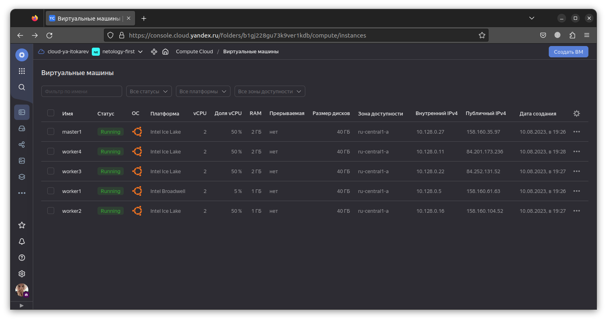

# Домашнее задание к занятию «Установка Kubernetes»

### Цель задания

Установить кластер K8s.

### Чеклист готовности к домашнему заданию

1. Развёрнутые ВМ с ОС Ubuntu 20.04-lts.



### Инструменты и дополнительные материалы, которые пригодятся для выполнения задания

1. [Инструкция по установке kubeadm](https://kubernetes.io/docs/setup/production-environment/tools/kubeadm/create-cluster-kubeadm/).
2. [Документация kubespray](https://kubespray.io/).

-----

### Задание 1. Установить кластер k8s с 1 master node

1. Подготовка работы кластера из 5 нод: 1 мастер и 4 рабочие ноды.
2. В качестве CRI — containerd.
3. Запуск etcd производить на мастере.
4. Способ установки выбрать самостоятельно.

### Ответ:

Поскольку мы не используем DNS-сервер, то для разрешения DNS-имен настроим файлы hosts на всех узлах кластера.
Добавим следующие строки в файл `/etc/hosts`:
```
10.128.0.27 master1
10.128.0.5 worker1
10.128.0.16 worker2
10.128.0.22 worker3
10.128.0.11 worker4
```
Это соответствут ip адресам виртуальных машин внутри зоны доступности yandex облака.

Убедимя в доступности узлов:
```bash
$ ping worker1
PING worker1 (10.128.0.5) 56(84) bytes of data.
64 bytes from worker1 (10.128.0.5): icmp_seq=1 ttl=61 time=1.25 ms
```

Настройка автозагрузки и запуск модуля ядра br_netfilter и overlay:
```bash
$ cat <<EOF | tee /etc/modules-load.d/k8s.conf
overlay
br_netfilter
EOF
```
```bash
$ modprobe overlay
$ modprobe br_netfilter
```

Разрешение маршрутизации IP-трафика:
```bash
$ echo -e "net.bridge.bridge-nf-call-ip6tables = 1\nnet.bridge.bridge-nf-call-iptables = 1\nnet.ipv4.ip_forward = 1" > /etc/sysctl.d/10-k8s.conf
$ sysctl -f /etc/sysctl.d/10-k8s.conf
```

Отключение файла подкачки:
```bash
$ swapoff -a
$ sed -i '/ swap / s/^/#/' /etc/fstab
```

Установаим зависимости и добавим репозиторий k8s:

```bash
$ curl -fsSL https://dl.k8s.io/apt/doc/apt-key.gpg | sudo gpg --dearmor -o /etc/apt/keyrings/kubernetes-archive-keyring.gpg
$ echo "deb [signed-by=/etc/apt/keyrings/kubernetes-archive-keyring.gpg] https://apt.kubernetes.io/ kubernetes-xenial main" | sudo tee /etc/apt/sources.list.d/kubernetes.list 
$ apt update && apt install kubelet kubeadm kubectl containerd
$ sudo apt-mark hold kubelet kubeadm kubectl
```

Выполним инициализацию кластера:
```bash
$ kubeadm init --apiserver-advertise-address=10.128.0.27 --pod-network-cidr 10.244.0.0/16 --apiserver-cert-extra-sans=158.160.35.97
```

Полуичм комаду для подключения остальных узлов k8s кластера, выполним ее на остальных виртуальных машинах:
```bash
$ kubeadm join 10.128.0.27:6443 --token 3c62l3.sdw5l74p44htrp6i \
	--discovery-token-ca-cert-hash sha256:1e9cbf016defdbe53f4b400def89f7ab70cb0fbd6011792fef35fdde0346a521
```

Скопируем кофиг файл на мастер ноде:
```bash
$ sudo cp -i /etc/kubernetes/admin.conf /home/user/.kube/config
$ sudo chown user:user /home/user/.kube/config
```

Посмотрим статус нод:
```bash
$ kubectl get nodes
NAME      STATUS     ROLES           AGE   VERSION
master1   NotReady   control-plane   10m   v1.27.4
worker1   NotReady   <none>          14s   v1.27.4
worker2   NotReady   <none>          31s   v1.27.4
worker3   NotReady   <none>          12s   v1.27.4
worker4   NotReady   <none>          10s   v1.27.4
```

Статус NotReady поскольку отсутствует сетевой плагин. Это видно из команды descibe:
```bash
$ kubectl describe node master1
Name:               master1
Roles:              control-plane
Labels:             beta.kubernetes.io/arch=amd64
                    beta.kubernetes.io/os=linux
                    kubernetes.io/arch=amd64
                    kubernetes.io/hostname=master1
                    kubernetes.io/os=linux
                    node-role.kubernetes.io/control-plane=
                    node.kubernetes.io/exclude-from-external-load-balancers=
Annotations:        kubeadm.alpha.kubernetes.io/cri-socket: unix:///var/run/containerd/containerd.sock
                    node.alpha.kubernetes.io/ttl: 0
                    volumes.kubernetes.io/controller-managed-attach-detach: true
CreationTimestamp:  Thu, 10 Aug 2023 18:29:29 +0000
Taints:             node-role.kubernetes.io/control-plane:NoSchedule
                    node.kubernetes.io/not-ready:NoSchedule
Unschedulable:      false
Lease:
  HolderIdentity:  master1
  AcquireTime:     <unset>
  RenewTime:       Thu, 10 Aug 2023 18:40:50 +0000
Conditions:
  Type             Status  LastHeartbeatTime                 LastTransitionTime                Reason                       Message
  ----             ------  -----------------                 ------------------                ------                       -------
  MemoryPressure   False   Thu, 10 Aug 2023 18:39:56 +0000   Thu, 10 Aug 2023 18:29:25 +0000   KubeletHasSufficientMemory   kubelet has sufficient memory available
  DiskPressure     False   Thu, 10 Aug 2023 18:39:56 +0000   Thu, 10 Aug 2023 18:29:25 +0000   KubeletHasNoDiskPressure     kubelet has no disk pressure
  PIDPressure      False   Thu, 10 Aug 2023 18:39:56 +0000   Thu, 10 Aug 2023 18:29:25 +0000   KubeletHasSufficientPID      kubelet has sufficient PID available
  Ready            False   Thu, 10 Aug 2023 18:39:56 +0000   Thu, 10 Aug 2023 18:29:25 +0000   KubeletNotReady              container runtime network not ready: NetworkReady=false reason:NetworkPluginNotReady message:Network plugin returns error: cni plugin not initialized
Addresses:
  InternalIP:  10.128.0.27
  Hostname:    master1
Capacity:
  cpu:                2
  ephemeral-storage:  41186748Ki
  hugepages-1Gi:      0
  hugepages-2Mi:      0
  memory:             2018400Ki
  pods:               110
Allocatable:
  cpu:                2
  ephemeral-storage:  37957706894
  hugepages-1Gi:      0
  hugepages-2Mi:      0
  memory:             1916000Ki
  pods:               110
System Info:
  Machine ID:                 23000007c6c0feec870595f804e26b90
  System UUID:                23000007-c6c0-feec-8705-95f804e26b90
  Boot ID:                    8d4eb352-7300-4219-b259-58afd940cab1
  Kernel Version:             5.4.0-155-generic
  OS Image:                   Ubuntu 20.04.6 LTS
  Operating System:           linux
  Architecture:               amd64
  Container Runtime Version:  containerd://1.7.2
  Kubelet Version:            v1.27.4
  Kube-Proxy Version:         v1.27.4
PodCIDR:                      10.244.0.0/24
PodCIDRs:                     10.244.0.0/24
Non-terminated Pods:          (5 in total)
  Namespace                   Name                               CPU Requests  CPU Limits  Memory Requests  Memory Limits  Age
  ---------                   ----                               ------------  ----------  ---------------  -------------  ---
  kube-system                 etcd-master1                       100m (5%)     0 (0%)      100Mi (5%)       0 (0%)         11m
  kube-system                 kube-apiserver-master1             250m (12%)    0 (0%)      0 (0%)           0 (0%)         11m
  kube-system                 kube-controller-manager-master1    200m (10%)    0 (0%)      0 (0%)           0 (0%)         11m
  kube-system                 kube-proxy-g4c6x                   0 (0%)        0 (0%)      0 (0%)           0 (0%)         11m
  kube-system                 kube-scheduler-master1             100m (5%)     0 (0%)      0 (0%)           0 (0%)         11m
Allocated resources:
  (Total limits may be over 100 percent, i.e., overcommitted.)
  Resource           Requests    Limits
  --------           --------    ------
  cpu                650m (32%)  0 (0%)
  memory             100Mi (5%)  0 (0%)
  ephemeral-storage  0 (0%)      0 (0%)
  hugepages-1Gi      0 (0%)      0 (0%)
  hugepages-2Mi      0 (0%)      0 (0%)
Events:
  Type     Reason                   Age                From             Message
  ----     ------                   ----               ----             -------
  Normal   Starting                 10m                kube-proxy       
  Normal   NodeHasSufficientMemory  11m (x8 over 11m)  kubelet          Node master1 status is now: NodeHasSufficientMemory
  Normal   NodeHasNoDiskPressure    11m (x7 over 11m)  kubelet          Node master1 status is now: NodeHasNoDiskPressure
  Normal   NodeHasSufficientPID     11m (x7 over 11m)  kubelet          Node master1 status is now: NodeHasSufficientPID
  Normal   NodeAllocatableEnforced  11m                kubelet          Updated Node Allocatable limit across pods
  Normal   Starting                 11m                kubelet          Starting kubelet.
  Warning  InvalidDiskCapacity      11m                kubelet          invalid capacity 0 on image filesystem
  Normal   NodeHasSufficientMemory  11m                kubelet          Node master1 status is now: NodeHasSufficientMemory
  Normal   NodeHasNoDiskPressure    11m                kubelet          Node master1 status is now: NodeHasNoDiskPressure
  Normal   NodeHasSufficientPID     11m                kubelet          Node master1 status is now: NodeHasSufficientPID
  Normal   NodeAllocatableEnforced  11m                kubelet          Updated Node Allocatable limit across pods
  Normal   RegisteredNode           11m                node-controller  Node master1 event: Registered Node master1 in Controller
```

Установим сетевой плагин:
```bash
$ kubectl apply -f https://raw.githubusercontent.com/flannel-io/flannel/master/Documentation/kube-flannel.yml
namespace/kube-flannel created
clusterrole.rbac.authorization.k8s.io/flannel created
clusterrolebinding.rbac.authorization.k8s.io/flannel created
serviceaccount/flannel created
configmap/kube-flannel-cfg created
daemonset.apps/kube-flannel-ds created
```

Кубернетес кластер с 1 master node и 4 worker node готов:
```bash
$ kubectl get nodes
NAME      STATUS   ROLES           AGE     VERSION
master1   Ready    control-plane   18m     v1.27.4
worker1   Ready    <none>          9m1s    v1.27.4
worker2   Ready    <none>          9m18s   v1.27.4
worker3   Ready    <none>          8m59s   v1.27.4
worker4   Ready    <none>          8m57s   v1.27.4
```

## Дополнительные задания (со звёздочкой)

**Настоятельно рекомендуем выполнять все задания под звёздочкой.** Их выполнение поможет глубже разобраться в материале.   
Задания под звёздочкой необязательные к выполнению и не повлияют на получение зачёта по этому домашнему заданию. 

------
### Задание 2*. Установить HA кластер

1. Установить кластер в режиме HA.
2. Использовать нечётное количество Master-node.
3. Для cluster ip использовать keepalived или другой способ.

### Правила приёма работы

1. Домашняя работа оформляется в своем Git-репозитории в файле README.md. Выполненное домашнее задание пришлите ссылкой на .md-файл в вашем репозитории.
2. Файл README.md должен содержать скриншоты вывода необходимых команд `kubectl get nodes`, а также скриншоты результатов.
3. Репозиторий должен содержать тексты манифестов или ссылки на них в файле README.md.
