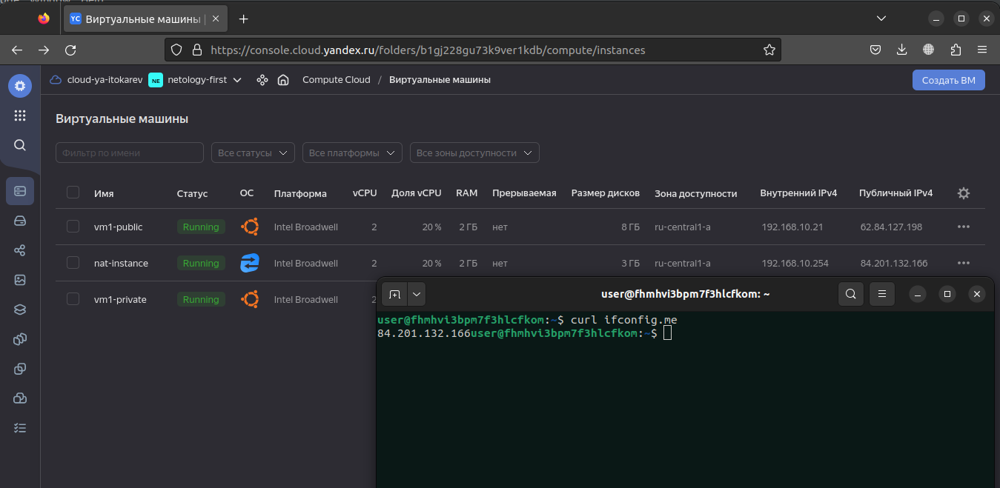

# Домашнее задание к занятию "15.1. Организация сети"

Домашнее задание будет состоять из обязательной части, которую необходимо выполнить на провайдере Яндекс.Облако и дополнительной части в AWS по желанию. Все домашние задания в 15 блоке связаны друг с другом и в конце представляют пример законченной инфраструктуры.  
Все задания требуется выполнить с помощью Terraform, результатом выполненного домашнего задания будет код в репозитории. 

Перед началом работ следует настроить доступ до облачных ресурсов из Terraform используя материалы прошлых лекций и [ДЗ](https://github.com/netology-code/virt-homeworks/tree/master/07-terraform-02-syntax ). А также заранее выбрать регион (в случае AWS) и зону.

---
## Задание 1. Яндекс.Облако (обязательное к выполнению)

Перед началом работы экспортируем токен, id облака и папки:
```bash
export YC_TOKEN=$(yc iam create-token)
export YC_CLOUD_ID=$(yc config get cloud-id)
export YC_FOLDER_ID=$(yc config get folder-id)
```

1. Создать VPC.
- Создать пустую VPC. Выбрать зону.

```hcl
resource "yandex_vpc_network" "default" {
  name        = "netology"
  description = "This is vpc for a netology project"
  folder_id   = var.yc_folder_id
}

```

2. Публичная подсеть.
- Создать в vpc subnet с названием public, сетью 192.168.10.0/24.

```hcl
resource "yandex_vpc_subnet" "public-subnet" {
  name           = "public"
  description    = "This subnet is for public usage"
  v4_cidr_blocks = ["192.168.10.0/24"]
  zone           = var.yc_region
  network_id     = "${yandex_vpc_network.default.id}"
}
```

- Создать в этой подсети NAT-инстанс, присвоив ему адрес 192.168.10.254. В качестве image_id использовать fd80mrhj8fl2oe87o4e1

```hcl
resource "yandex_compute_instance" "nat-instance" {
  name        = "nat-instance"
  platform_id = "standard-v1"
  zone        = var.yc_region

  resources {
    core_fraction = 20
    cores         = 2
    memory        = 2
  }

  boot_disk {
    initialize_params {
      image_id = data.yandex_compute_image.nat-image.id
    }
  }

  network_interface {
    subnet_id  = "${yandex_vpc_subnet.public-subnet.id}"
    nat        = true
    ip_address = var.nat_instance_ip
  }

  metadata = {
    user-data = "users:\n  - name: ${var.vm_user_nat}\n    groups: sudo\n    shell: /bin/bash\n    sudo: ['ALL=(ALL) NOPASSWD:ALL']\n    ssh-authorized-keys:\n      - ${file("${var.ssh_key_path}")}"
  }
}
```

- Создать в этой публичной подсети виртуалку с публичным IP и подключиться к ней, убедиться что есть доступ к интернету.

```hcl
resource "yandex_compute_instance" "vm-public" {
  name        = "vm1-public"
  platform_id = "standard-v1"
  zone        = var.yc_region

  resources {
    core_fraction = 20
    cores         = 2
    memory        = 2
  }

  boot_disk {
    initialize_params {
      image_id = data.yandex_compute_image.ubuntu-image.id
    }
  }

  network_interface {
    subnet_id  = "${yandex_vpc_subnet.public-subnet.id}"
    nat        = true
  }

  metadata = {
    user-data = "users:\n  - name: ${var.vm_user}\n    groups: sudo\n    shell: /bin/bash\n    sudo: ['ALL=(ALL) NOPASSWD:ALL']\n    ssh-authorized-keys:\n      - ${file("${var.ssh_key_path}")}"
  }
}
```

3. Приватная подсеть.
- Создать в vpc subnet с названием private, сетью 192.168.20.0/24.

```hcl
resource "yandex_vpc_subnet" "private-subnet" {
  name           = "private"
  description    = "This subnet is for private usage"
  v4_cidr_blocks = ["192.168.20.0/24"]
  zone           = var.yc_region
  network_id     = "${yandex_vpc_network.default.id}"
  route_table_id = "${yandex_vpc_route_table.nat-instance-route.id}"
}
```

- Создать route table. Добавить статический маршрут, направляющий весь исходящий трафик private сети в NAT-инстанс

```hcl
resource "yandex_vpc_route_table" "nat-instance-route" {
  name       = "nat-instance-route"
  network_id = "${yandex_vpc_network.default.id}"
  static_route {
    destination_prefix = "0.0.0.0/0"
    next_hop_address   = "${yandex_compute_instance.nat-instance.network_interface.0.ip_address}"
  }
}
```

- Создать в этой приватной подсети виртуалку с внутренним IP, подключиться к ней через виртуалку, созданную ранее и убедиться что есть доступ к интернету

```hcl
resource "yandex_compute_instance" "vm-private" {
  name        = "vm1-private"
  platform_id = "standard-v1"
  zone        = var.yc_region

  resources {
    core_fraction = 20
    cores         = 2
    memory        = 2
  }

  boot_disk {
    initialize_params {
      image_id = data.yandex_compute_image.ubuntu-image.id
    }
  }

  network_interface {
    subnet_id  = "${yandex_vpc_subnet.private-subnet.id}"
    nat        = false
  }

  metadata = {
    user-data = "users:\n  - name: ${var.vm_user}\n    groups: sudo\n    shell: /bin/bash\n    sudo: ['ALL=(ALL) NOPASSWD:ALL']\n    ssh-authorized-keys:\n      - ${file("${var.ssh_key_path}")}"
  }
}
```

Демонстрация:

Подключимся к ВМ с белым ip-адресом:

```bash
...
Outputs:

external_ip_address_vm1-public = "62.84.127.198"
internal_ip_address_vm1-private = "192.168.20.16"
$ ssh -i ~/.ssh/id_rsa_yc user@62.84.127.198
Welcome to Ubuntu 22.04.3 LTS (GNU/Linux 5.15.0-78-generic x86_64)

 * Documentation:  https://help.ubuntu.com
 * Management:     https://landscape.canonical.com
 * Support:        https://ubuntu.com/advantage

  System information as of Wed Aug 16 08:19:26 PM UTC 2023

  System load:  1.66015625        Processes:             136
  Usage of /:   52.3% of 7.79GB   Users logged in:       0
  Memory usage: 10%               IPv4 address for eth0: 192.168.10.21
  Swap usage:   0%


Expanded Security Maintenance for Applications is not enabled.

0 updates can be applied immediately.

Enable ESM Apps to receive additional future security updates.
See https://ubuntu.com/esm or run: sudo pro status


The programs included with the Ubuntu system are free software;
the exact distribution terms for each program are described in the
individual files in /usr/share/doc/*/copyright.

Ubuntu comes with ABSOLUTELY NO WARRANTY, to the extent permitted by
applicable law.

To run a command as administrator (user "root"), use "sudo <command>".
See "man sudo_root" for details.

user@fhmb628mhr80hkjbck9n:~$
```

Добавим RSA ключ для подключения к другой ВМ и подключимся к ней:

```bash
user@fhmb628mhr80hkjbck9n:~$ ssh user@192.168.20.16
Welcome to Ubuntu 22.04.3 LTS (GNU/Linux 5.15.0-78-generic x86_64)

 * Documentation:  https://help.ubuntu.com
 * Management:     https://landscape.canonical.com
 * Support:        https://ubuntu.com/advantage

  System information as of Wed Aug 16 08:24:24 PM UTC 2023

  System load:  0.18017578125     Processes:             134
  Usage of /:   52.3% of 7.79GB   Users logged in:       0
  Memory usage: 11%               IPv4 address for eth0: 192.168.20.16
  Swap usage:   0%


Expanded Security Maintenance for Applications is not enabled.

0 updates can be applied immediately.

Enable ESM Apps to receive additional future security updates.
See https://ubuntu.com/esm or run: sudo pro status


The programs included with the Ubuntu system are free software;
the exact distribution terms for each program are described in the
individual files in /usr/share/doc/*/copyright.

Ubuntu comes with ABSOLUTELY NO WARRANTY, to the extent permitted by
applicable law.

To run a command as administrator (user "root"), use "sudo <command>".
See "man sudo_root" for details.

user@fhmhvi3bpm7f3hlcfkom:~$
```

Проверим доступность сети через nat:

```bash
user@fhmhvi3bpm7f3hlcfkom:~$ curl ifconfig.me
84.201.132.166
```

ip адрес соответствует адресу nat инстанса.



Resource terraform для ЯО
- [VPC subnet](https://registry.terraform.io/providers/yandex-cloud/yandex/latest/docs/resources/vpc_subnet)
- [Route table](https://registry.terraform.io/providers/yandex-cloud/yandex/latest/docs/resources/vpc_route_table)
- [Compute Instance](https://registry.terraform.io/providers/yandex-cloud/yandex/latest/docs/resources/compute_instance)
