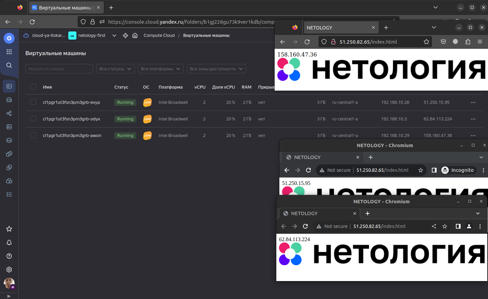
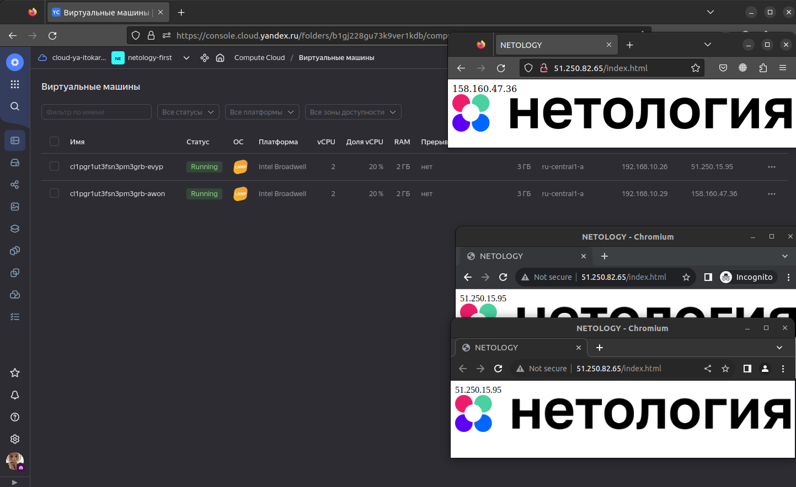
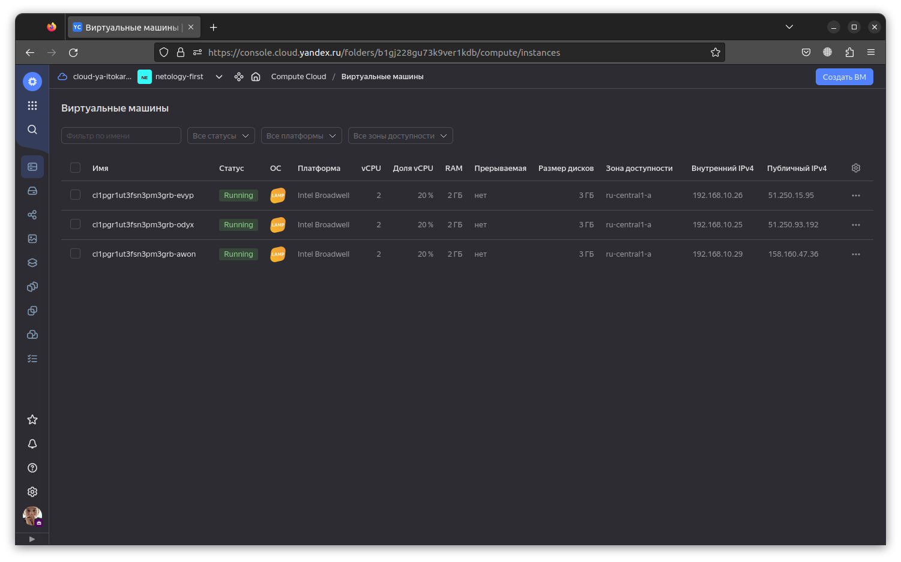

# Домашнее задание к занятию 15.2 "Вычислительные мощности. Балансировщики нагрузки".
Домашнее задание будет состоять из обязательной части, которую необходимо выполнить на провайдере Яндекс.Облако, и дополнительной части в AWS (можно выполнить по желанию). Все домашние задания в 15 блоке связаны друг с другом и в конце представляют пример законченной инфраструктуры.
Все задания требуется выполнить с помощью Terraform, результатом выполненного домашнего задания будет код в репозитории. Перед началом работ следует настроить доступ до облачных ресурсов из Terraform, используя материалы прошлых лекций и ДЗ.

---
## Задание 1. Яндекс.Облако (обязательное к выполнению)

Перед началом работы экспортируем токен, id облака и папки:
```bash
export YC_TOKEN=$(yc iam create-token)
export YC_CLOUD_ID=$(yc config get cloud-id)
export YC_FOLDER_ID=$(yc config get folder-id)
```

1. Создать bucket Object Storage и разместить там файл с картинкой:
- Создать bucket в Object Storage с произвольным именем (например, _имя_студента_дата_);

Для работы с бакетом необходимо создать сервисный акаунт с ролью `storage.editor`:

```hcl
resource "yandex_iam_service_account" "sa-bucket" {
  folder_id = var.yc_folder_id
  name      = var.yc_sa_bucket
}

resource "yandex_resourcemanager_folder_iam_member" "sa-editor" {
  folder_id = var.yc_folder_id
  role      = "storage.editor"
  member    = "serviceAccount:${yandex_iam_service_account.sa-bucket.id}"
}

resource "yandex_iam_service_account_static_access_key" "sa-static-key" {
  service_account_id = yandex_iam_service_account.sa-bucket.id
  description        = "static access key for object storage"
}

resource "yandex_storage_bucket" "pictures" {
  access_key = yandex_iam_service_account_static_access_key.sa-static-key.access_key
  secret_key = yandex_iam_service_account_static_access_key.sa-static-key.secret_key
  bucket     = var.bucket_name
}
```

- Положить в bucket файл с картинкой;

```hcl
resource "yandex_storage_object" "picture" {
  access_key = yandex_iam_service_account_static_access_key.sa-static-key.access_key
  secret_key = yandex_iam_service_account_static_access_key.sa-static-key.secret_key  
  bucket     = var.bucket_name
  key        = "netology_logo"
  source     = "../media/netology.png"
}
```

- Сделать файл доступным из Интернет.

```hcl
resource "yandex_storage_bucket" "pictures" {
  access_key = yandex_iam_service_account_static_access_key.sa-static-key.access_key
  secret_key = yandex_iam_service_account_static_access_key.sa-static-key.secret_key
  bucket     = var.bucket_name

  anonymous_access_flags {
    read = true
    list = false
  }
}
```

2. Создать группу ВМ в public подсети фиксированного размера с шаблоном LAMP и web-страничкой, содержащей ссылку на картинку из bucket:
- Создать Instance Group с 3 ВМ и шаблоном LAMP. Для LAMP рекомендуется использовать `image_id = fd827b91d99psvq5fjit`;

```hcl
resource "yandex_iam_service_account" "ig-sa" {
  name        = "ig-sa"
  description = "service account to manage Instance Group"
}

resource "yandex_resourcemanager_folder_iam_member" "editor" {
  folder_id  = var.yc_folder_id
  role       = "editor"
  member     = "serviceAccount:${yandex_iam_service_account.ig-sa.id}"
  depends_on = [
    yandex_iam_service_account.ig-sa,
  ]
}

resource "yandex_compute_instance_group" "lamp-vms" {
  name                = "vm-lamp"
  folder_id           = var.yc_folder_id
  service_account_id  = "${yandex_iam_service_account.ig-sa.id}"
  depends_on          = [yandex_resourcemanager_folder_iam_member.editor]
  deletion_protection = false

  load_balancer {
    target_group_name = "lamp-vms"
  }

  instance_template {
    platform_id = "standard-v1"
    resources {
      core_fraction = 20
      cores         = 2
      memory        = 2
    }
    boot_disk {
      initialize_params {
        image_id = data.yandex_compute_image.lamp-image.id
      }
    }
    network_interface {
      subnet_ids  = ["${yandex_vpc_subnet.public-subnet.id}"]
      nat         = true
    }
    metadata = {
      user-data = "${file("lamp-init.yaml")}"
    }
  }
  scale_policy {
    fixed_scale {
      size = 3
    }
  }
  allocation_policy {
    zones = ["ru-central1-a"]
  }
  deploy_policy {
    max_unavailable = 1
    max_expansion   = 0
  }
}
```

- Для создания стартовой веб-страницы рекомендуется использовать раздел `user_data` в [meta_data](https://cloud.yandex.ru/docs/compute/concepts/vm-metadata);

```hcl
  metadata = {
    user-data = "${file("lamp-init.yaml")}"
  }
```

lamp-init.yaml:

```yaml
#cloud-config
runcmd:
  - echo '<html>\n<head>\n<title>NETOLOGY</title>\n</head>\n<body>\n'`cat /etc/hostname`'\n</body>\n</html>' > /var/www/html/index.html
users:
  - name: ${var.vm_user}
    groups: sudo
    shell: /bin/bash
    sudo: ['ALL=(ALL) NOPASSWD:ALL']
    ssh-authorized-keys:
      - ${file("${var.ssh_key_path}")}
```

- Разместить в стартовой веб-странице шаблонной ВМ ссылку на картинку из bucket;

```html
<html>
<head>
<title>NETOLOGY</title>
</head>
<body>
`cat /etc/hostname`

</body>
</html>
```

- Настроить проверку состояния ВМ.

Из документации yandex cloud:

```
Instance Groups раз в несколько секунд автоматически проверяет статус ВМ в Compute Cloud. Если ВМ
остановилась или произошла ошибка (статусы STOPPED, ERROR, CRASHED), Instance Groups попробует 
перезапустить ее, а также создаст новую ВМ, если это позволяет политика развертывания.
```

3. Подключить группу к сетевому балансировщику:
- Создать сетевой балансировщик;

```hcl
resource "yandex_lb_network_load_balancer" "nlb" {
  name                = "lamp-lb"
  deletion_protection = false

  listener {
    name = "nlb"
    port = 80
    external_address_spec {
      ip_version = "ipv4"
    }
  }
  attached_target_group {
    target_group_id = yandex_compute_instance_group.lamp-vms.load_balancer.0.target_group_id
    healthcheck {
      name = "http"
      http_options {
        port = 80
        path = "/index.html"
      }
    } 
  }
}
```

- Проверить работоспособность, удалив одну или несколько ВМ.



При удалении одной из ВМ network load balance'р переключил трафик на одну из оставшихся ВМ.



Через какое то время Instance Group поднимет недостающую ВМ.



[Terraform](./terraform)

4. *Создать Application Load Balancer с использованием Instance group и проверкой состояния.

Документация
- [Compute instance group](https://registry.terraform.io/providers/yandex-cloud/yandex/latest/docs/resources/compute_instance_group)
- [Network Load Balancer](https://registry.terraform.io/providers/yandex-cloud/yandex/latest/docs/resources/lb_network_load_balancer)
- [Группа ВМ с сетевым балансировщиком](https://cloud.yandex.ru/docs/compute/operations/instance-groups/create-with-balancer)
---
## Задание 2*. AWS (необязательное к выполнению)

Используя конфигурации, выполненные в рамках ДЗ на предыдущем занятии, добавить к Production like сети Autoscaling group из 3 EC2-инстансов с  автоматической установкой web-сервера в private домен.

1. Создать bucket S3 и разместить там файл с картинкой:
- Создать bucket в S3 с произвольным именем (например, _имя_студента_дата_);
- Положить в bucket файл с картинкой;
- Сделать доступным из Интернета.
2. Сделать Launch configurations с использованием bootstrap скрипта с созданием веб-странички на которой будет ссылка на картинку в S3. 
3. Загрузить 3 ЕС2-инстанса и настроить LB с помощью Autoscaling Group.

Resource terraform
- [S3 bucket](https://registry.terraform.io/providers/hashicorp/aws/latest/docs/resources/s3_bucket)
- [Launch Template](https://registry.terraform.io/providers/hashicorp/aws/latest/docs/resources/launch_template)
- [Autoscaling group](https://registry.terraform.io/providers/hashicorp/aws/latest/docs/resources/autoscaling_group)
- [Launch configuration](https://registry.terraform.io/providers/hashicorp/aws/latest/docs/resources/launch_configuration)

Пример bootstrap-скрипта:
```
#!/bin/bash
yum install httpd -y
service httpd start
chkconfig httpd on
cd /var/www/html
echo "<html><h1>My cool web-server</h1></html>" > index.html
```
