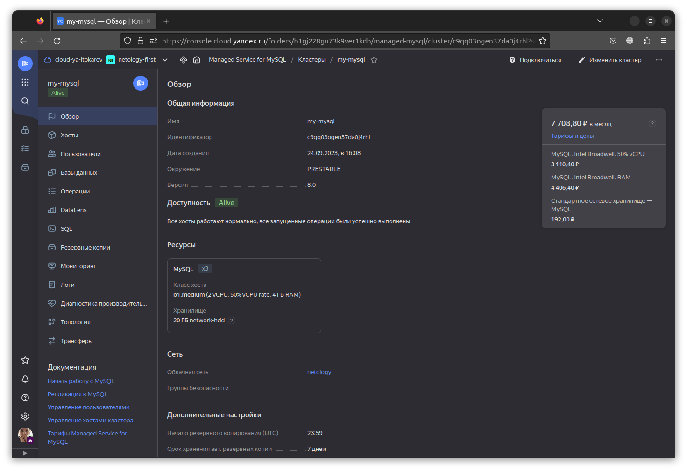

# Домашнее задание к занятию 15.4 "Кластеры. Ресурсы под управлением облачных провайдеров"

Организация кластера Kubernetes и кластера баз данных MySQL в отказоустойчивой архитектуре.
Размещение в private подсетях кластера БД, а в public - кластера Kubernetes.


```bash
export YC_TOKEN=$(yc iam create-token)
export YC_CLOUD_ID=$(yc config get cloud-id)
export YC_FOLDER_ID=$(yc config get folder-id)
```

---
## Задание 1. Яндекс.Облако (обязательное к выполнению)

1. Настроить с помощью Terraform кластер баз данных MySQL:
- Используя настройки VPC с предыдущих ДЗ, добавить дополнительно подсеть private в разных зонах, чтобы обеспечить отказоустойчивость
- Разместить ноды кластера MySQL в разных подсетях

```hcl
...
  host {
    zone             = "ru-central1-a"
    subnet_id        = "${yandex_vpc_subnet.private-subnet-a.id}"
    assign_public_ip = false
    backup_priority  = 10
  }

  host {
    zone             = "ru-central1-b"
    subnet_id        = "${yandex_vpc_subnet.private-subnet-b.id}"
    assign_public_ip = false
  }

  host {
    zone             = "ru-central1-c"
    subnet_id        = "${yandex_vpc_subnet.private-subnet-c.id}"
    assign_public_ip = false
  }
...
```

- Необходимо предусмотреть репликацию с произвольным временем технического обслуживания

```hcl
...
  maintenance_window {
    type = "ANYTIME"
  }
...
```

- Использовать окружение PRESTABLE, платформу Intel Broadwell с производительностью 50% CPU и размером диска 20 Гб

```hcl
...
  resources {
    resource_preset_id = "b1.medium"  # intel Broadwell с производительностью 50% CPU
    disk_type_id       = "network-hdd"
    disk_size          = 20
  } 
...
```

- Задать время начала резервного копирования - 23:59

```hcl
...
  backup_window_start {
    hours   = 23
    minutes = 59
  }
...
```

- Включить защиту кластера от непреднамеренного удаления

```hcl
...
  deletion_protection = true
...
```

- Создать БД с именем `netology_db` c логином и паролем

```hcl
resource "yandex_mdb_mysql_database" "netology-db" {
  cluster_id = "${yandex_mdb_mysql_cluster.my-mysql.id}"
  name       = "netology_db"
}

resource "yandex_mdb_mysql_user" "mysql-user" {
  cluster_id = "${yandex_mdb_mysql_cluster.my-mysql.id}"
  name       = var.mysql_user
  password   = var.mysql_password
  permission {
    database_name = yandex_mdb_mysql_database.netology-db.name
    roles         = ["ALL"]
  }
}
```




2. Настроить с помощью Terraform кластер Kubernetes
- Используя настройки VPC с предыдущих ДЗ, добавить дополнительно 2 подсети public в разных зонах, чтобы обеспечить отказоустойчивость
- Создать отдельный сервис-аккаунт с необходимыми правами 

```hcl
resource "yandex_iam_service_account" "sa" {
  folder_id = var.yc_folder_id
  name      = "sa"
}

resource "yandex_resourcemanager_folder_iam_member" "editor" {
  folder_id = var.yc_folder_id
  role      = "editor"
  member    = "serviceAccount:${yandex_iam_service_account.sa.id}"
}

resource "yandex_resourcemanager_folder_iam_member" "images-puller" {
  folder_id = var.yc_folder_id
  role      = "container-registry.images.puller"
  member    = "serviceAccount:${yandex_iam_service_account.sa.id}"
}
```

- Создать региональный мастер kubernetes с размещением нод в разных 3 подсетях

```hcl
...
    regional {
      region = "ru-central1"

      location {
        zone      = "${yandex_vpc_subnet.private-subnet-a.zone}"
        subnet_id = "${yandex_vpc_subnet.private-subnet-a.id}"
      }

      location {
        zone      = "${yandex_vpc_subnet.private-subnet-b.zone}"
        subnet_id = "${yandex_vpc_subnet.private-subnet-b.id}"
      }

      location {
        zone      = "${yandex_vpc_subnet.private-subnet-c.zone}"
        subnet_id = "${yandex_vpc_subnet.private-subnet-c.id}"
      }
    }
...
```

- Добавить возможность шифрования ключом из KMS, созданного в предыдущем ДЗ

```hcl
...
  kms_provider {
    key_id = yandex_kms_symmetric_key.key.id
  }
...
```

- Создать группу узлов состояющую из 3 машин с автомасштабированием до 6

```hcl
...
  scale_policy {
    auto_scale {
      min     = 3
      max     = 6
      initial = 3
    }
  }
...
```

- Подключиться к кластеру с помощью `kubectl`


- *Запустить микросервис phpmyadmin и подключиться к БД, созданной ранее

```yaml
apiVersion: apps/v1
kind: Deployment
metadata:
  name: phpadmin
spec:
  selector:
    matchLabels:
      app: phpadmin
  template:
    metadata:
      labels:
        app: phpadmin
    spec:
      containers:
      - image: phpmyadmin/phpmyadmin:5.2.1
        name: phpadmin
        ports:
        - containerPort: 80
        env:
        - name: PMA_USER
          value: "user"
        - name: PMA_PASSWORD 
          value: "password"
        - name: PMA_HOST
          value: "rc1b-ltp3dghkuim7as6a.mdb.yandexcloud.net"
```

- *Создать сервис типы Load Balancer и подключиться к phpmyadmin. Предоставить скриншот с публичным адресом и подключением к БД

```yaml
apiVersion: v1
kind: Service
metadata:
  name: phpadmin-service
spec:
  type: LoadBalancer
  selector:
    app: phpadmin
  ports:
  - protocol: TCP
    port: 80
    targetPort: 80
```

```bash
$ kubectl get svc
NAME               TYPE           CLUSTER-IP      EXTERNAL-IP      PORT(S)        AGE
kubernetes         ClusterIP      10.96.128.1     <none>           443/TCP        52m
phpadmin-service   LoadBalancer   10.96.239.173   158.160.55.101   80:31695/TCP   10s
```


Документация
- [MySQL cluster](https://registry.terraform.io/providers/yandex-cloud/yandex/latest/docs/resources/mdb_mysql_cluster)
- [Создание кластера kubernetes](https://cloud.yandex.ru/docs/managed-kubernetes/operations/kubernetes-cluster/kubernetes-cluster-create)
- [K8S Cluster](https://registry.terraform.io/providers/yandex-cloud/yandex/latest/docs/resources/kubernetes_cluster)
- [K8S node group](https://registry.terraform.io/providers/yandex-cloud/yandex/latest/docs/resources/kubernetes_node_group)
--- 
## Задание 2. Вариант с AWS (необязательное к выполнению)

1. Настроить с помощью terraform кластер EKS в 3 AZ региона, а также RDS на базе MySQL с поддержкой MultiAZ для репликации и создать 2 readreplica для работы:
- Создать кластер RDS на базе MySQL
- Разместить в Private subnet и обеспечить доступ из public-сети c помощью security-group
- Настроить backup в 7 дней и MultiAZ для обеспечения отказоустойчивости
- Настроить Read prelica в кол-ве 2 шт на 2 AZ.

2. Создать кластер EKS на базе EC2:
- С помощью terraform установить кластер EKS на 3 EC2-инстансах в VPC в public-сети
- Обеспечить доступ до БД RDS в private-сети
- С помощью kubectl установить и запустить контейнер с phpmyadmin (образ взять из docker hub) и проверить подключение к БД RDS
- Подключить ELB (на выбор) к приложению, предоставить скрин

Документация
- [Модуль EKS](https://learn.hashicorp.com/tutorials/terraform/eks)
