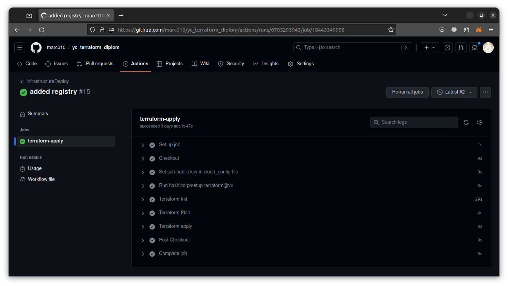

# Дипломный практикум в Yandex.Cloud
  * [Цели:](#цели)
  * [Этапы выполнения:](#этапы-выполнения)
     * [Создание облачной инфраструктуры](#создание-облачной-инфраструктуры)
     * [Создание Kubernetes кластера](#создание-kubernetes-кластера)
     * [Создание тестового приложения](#создание-тестового-приложения)
     * [Подготовка cистемы мониторинга и деплой приложения](#подготовка-cистемы-мониторинга-и-деплой-приложения)
     * [Установка и настройка CI/CD](#установка-и-настройка-cicd)
  * [Что необходимо для сдачи задания?](#что-необходимо-для-сдачи-задания)
  * [Как правильно задавать вопросы дипломному руководителю?](#как-правильно-задавать-вопросы-дипломному-руководителю)

**Перед началом работы над дипломным заданием изучите [Инструкция по экономии облачных ресурсов](https://github.com/netology-code/devops-materials/blob/master/cloudwork.MD).**

---
## Цели:

1. Подготовить облачную инфраструктуру на базе облачного провайдера Яндекс.Облако.
2. Запустить и сконфигурировать Kubernetes кластер.
3. Установить и настроить систему мониторинга.
4. Настроить и автоматизировать сборку тестового приложения с использованием Docker-контейнеров.
5. Настроить CI для автоматической сборки и тестирования.
6. Настроить CD для автоматического развёртывания приложения.

---
## Этапы выполнения:


### Создание облачной инфраструктуры

Для начала необходимо подготовить облачную инфраструктуру в ЯО при помощи [Terraform](https://www.terraform.io/).

Особенности выполнения:

- Бюджет купона ограничен, что следует иметь в виду при проектировании инфраструктуры и использовании ресурсов;
Для облачного k8s используйте региональный мастер(неотказоустойчивый). Для self-hosted k8s минимизируйте ресурсы ВМ и долю ЦПУ. В обоих вариантах используйте прерываемые ВМ для worker nodes.
- Следует использовать версию [Terraform](https://www.terraform.io/) не старше 1.5.x .

Предварительная подготовка к установке и запуску Kubernetes кластера.

1. Создайте сервисный аккаунт, который будет в дальнейшем использоваться Terraform для работы с инфраструктурой с необходимыми и достаточными правами. Не стоит использовать права суперпользователя

[Выполнение](diplom/00-pre-use-terraform/README.md)

2. Подготовьте [backend](https://www.terraform.io/docs/language/settings/backends/index.html) для Terraform:  
   а. Рекомендуемый вариант: S3 bucket в созданном ЯО аккаунте(создание бакета через TF)


б. Альтернативный вариант:  [Terraform Cloud](https://app.terraform.io/)  
3. Создайте VPC с подсетями в разных зонах доступности.

[Выполнение](diplom/01-terraform/README.md)

4. Убедитесь, что теперь вы можете выполнить команды `terraform destroy` и `terraform apply` без дополнительных ручных действий.
5. В случае использования [Terraform Cloud](https://app.terraform.io/) в качестве [backend](https://www.terraform.io/docs/language/settings/backends/index.html) убедитесь, что применение изменений успешно проходит, используя web-интерфейс Terraform cloud.

Репозиторий с инфраструктурой: https://github.com/marc010/yc_terraform_diplom


Ожидаемые результаты:

1. Terraform сконфигурирован и создание инфраструктуры посредством Terraform возможно без дополнительных ручных действий.
2. Полученная конфигурация инфраструктуры является предварительной, поэтому в ходе дальнейшего выполнения задания возможны изменения.

---
### Создание Kubernetes кластера

На этом этапе необходимо создать [Kubernetes](https://kubernetes.io/ru/docs/concepts/overview/what-is-kubernetes/) кластер на базе предварительно созданной инфраструктуры.   Требуется обеспечить доступ к ресурсам из Интернета.

Это можно сделать двумя способами:

1. Рекомендуемый вариант: самостоятельная установка Kubernetes кластера.  

а. При помощи Terraform подготовить как минимум 3 виртуальных машины Compute Cloud для создания Kubernetes-кластера. Тип виртуальной машины следует выбрать самостоятельно с учётом требовании к производительности и стоимости. Если в дальнейшем поймете, что необходимо сменить тип инстанса, используйте Terraform для внесения изменений.  

[Выполнение](diplom/01-terraform/README.md)

б. Подготовить [ansible](https://www.ansible.com/) конфигурации, можно воспользоваться, например [Kubespray](https://kubernetes.io/docs/setup/production-environment/tools/kubespray/)  

Сконфигурировать требуемые значения для kubespray:

* В файле [`group_vars/k8s_cluster/k8s-net-calico.yml`](./diplom/02-kubespray/inventory/yc-cluster/group_vars/k8s_cluster/k8s-net-calico.yml)
настроить calico cni плагин. 
```yaml
...
calico_ipip_mode: 'CrossSubnet'  # Определяем когда использовать IP in IP режим.
...
calico_vxlan_mode: 'Never'  # Отключение режима vxlan
...
```

* В файле [`group_vars/k8s_cluster/k8s-cluster.yml`](./diplom/02-kubespray/inventory/yc-cluster/group_vars/k8s_cluster/k8s-cluster.yml)
настроить k8s cluster.
```yaml
...
kube_version: v1.28.3  # Выбираем версию кластера k8s.
...
kube_network_plugin: calico  # Выбираем драйвер сети кластера.
...
supplementary_addresses_in_ssl_keys: [x.x.x.x]  # Указываем внешний ip адрес master ноды
...
container_manager: containerd  # определяем систему контейнеризации.
...
system_memory_reserved: 512Mi  # зарезервированная за Linux системой память.
...
system_cpu_reserved: 500m  # зарезервированное за Linux системой время процессора.
...
```

в. Задеплоить Kubernetes на подготовленные ранее инстансы, в случае нехватки каких-либо ресурсов вы всегда можете создать их при помощи Terraform.

С помощью файла [`generate_inventory.sh`](./diplom/01-terraform/generate_inventory.sh) получить
файл инвентори для kubespray:

```bash
./generate_inventory.sh > ../02-kubespray/inventory/yc-cluster/inventory.ini
```

Указать путь до файла `ansible.cfg` в переменной `ANSIBLE_CONFIG`:

```bash
export ANSIBLE_CONFIG=$(pwd)/diplom/02-kubespray/ansible.cfg
```

Запустить ansible-playbook

```bash
ansible-playbook -i ./diplom/02-kubespray/inventory/yc-cluster/inventory.ini  --become --become-user=root ./diplom/02-kubespray/cluster.yml --private-key=~/.ssh/id_rsa_yc
```

Скопировать файл kubernetes config с master ноды `/etc/kubernetes/admin.conf` и изменить
в нем адрес для подключения с 127.0.0.1 на адрес master ноды.

Результат:

```bash
$ kubectl get nodes -o wide
NAME      STATUS   ROLES           AGE    VERSION   INTERNAL-IP     EXTERNAL-IP   OS-IMAGE             KERNEL-VERSION      CONTAINER-RUNTIME
master1   Ready    control-plane   3d2h   v1.28.3   192.168.10.4    <none>        Ubuntu 22.04.3 LTS   5.15.0-88-generic   containerd://1.7.7
worker1   Ready    <none>          3d2h   v1.28.3   192.168.10.31   <none>        Ubuntu 22.04.3 LTS   5.15.0-88-generic   containerd://1.7.7
worker2   Ready    <none>          3d2h   v1.28.3   192.168.11.5    <none>        Ubuntu 22.04.3 LTS   5.15.0-88-generic   containerd://1.7.7
worker3   Ready    <none>          3d2h   v1.28.3   192.168.12.5    <none>        Ubuntu 22.04.3 LTS   5.15.0-88-generic   containerd://1.7.7
```

2. Альтернативный вариант: воспользуйтесь сервисом [Yandex Managed Service for Kubernetes](https://cloud.yandex.ru/services/managed-kubernetes)  
  а. С помощью terraform resource для [kubernetes](https://registry.terraform.io/providers/yandex-cloud/yandex/latest/docs/resources/kubernetes_cluster) создать **региональный** мастер kubernetes с размещением нод в разных 3 подсетях      
  б. С помощью terraform resource для [kubernetes node group](https://registry.terraform.io/providers/yandex-cloud/yandex/latest/docs/resources/kubernetes_node_group)
  
Ожидаемый результат:

1. Работоспособный Kubernetes кластер.
2. В файле `~/.kube/config` находятся данные для доступа к кластеру.
3. Команда `kubectl get pods --all-namespaces` отрабатывает без ошибок.

---
### Создание тестового приложения

Для перехода к следующему этапу необходимо подготовить тестовое приложение, эмулирующее основное приложение разрабатываемое вашей компанией.

Способ подготовки:

1. Рекомендуемый вариант:  
   а. Создайте отдельный git репозиторий с простым nginx конфигом, который будет отдавать статические данные.
   
[Выполнение](https://github.com/marc010/test_app)

   б. Подготовьте Dockerfile для создания образа приложения.  

[Выполнение](https://github.com/marc010/test_app/blob/main/Dockerfile)

2. Альтернативный вариант:  
   а. Используйте любой другой код, главное, чтобы был самостоятельно создан Dockerfile.

Ожидаемый результат:

1. Git репозиторий с тестовым приложением и Dockerfile.
2. Регистри с собранным docker image. В качестве регистри может быть DockerHub или [Yandex Container Registry](https://cloud.yandex.ru/services/container-registry), созданный также с помощью terraform.

---
### Подготовка cистемы мониторинга и деплой приложения

Уже должны быть готовы конфигурации для автоматического создания облачной инфраструктуры и поднятия Kubernetes кластера.  
Теперь необходимо подготовить конфигурационные файлы для настройки нашего Kubernetes кластера.

Цель:
1. Задеплоить в кластер [prometheus](https://prometheus.io/), [grafana](https://grafana.com/), [alertmanager](https://github.com/prometheus/alertmanager), [экспортер](https://github.com/prometheus/node_exporter) основных метрик Kubernetes.
2. Задеплоить тестовое приложение, например, [nginx](https://www.nginx.com/) сервер отдающий статическую страницу.

Способ выполнения:
1. Воспользовать пакетом [kube-prometheus](https://github.com/prometheus-operator/kube-prometheus), который уже включает в себя [Kubernetes оператор](https://operatorhub.io/) для [grafana](https://grafana.com/), [prometheus](https://prometheus.io/), [alertmanager](https://github.com/prometheus/alertmanager) и [node_exporter](https://github.com/prometheus/node_exporter). При желании можете собрать все эти приложения отдельно.

```bash
kubectl apply --server-side -f ./diplom/03-monitoring/manifests/setup
kubectl wait \
	--for condition=Established \
	--all CustomResourceDefinition \
	--namespace=monitoring
kubectl apply -f ./diplom/03-monitoring/manifests/
```

Настройка сервиса типа [NodePort](./diplom/03-monitoring/manifests/grafana-service.yaml)
для доступа к web интерфейсу grafana и [network policy](./diplom/03-monitoring/manifests/grafana-networkPolicy.yaml):

```bash
kubectl apply -f ./diplom/03-monitoring/manifests/grafana-service.yaml
kubectl apply -f ./diplom/03-monitoring/manifests/grafana-networkPolicy.yaml
```

Доступ по ip адресу любой ноды кластера на порт 32300


2. Для организации конфигурации использовать [qbec](https://qbec.io/), основанный на [jsonnet](https://jsonnet.org/). Обратите внимание на имеющиеся функции для интеграции helm конфигов и [helm charts](https://helm.sh/)
3. Если на первом этапе вы не воспользовались [Terraform Cloud](https://app.terraform.io/), то задеплойте и настройте в кластере [atlantis](https://www.runatlantis.io/) для отслеживания изменений инфраструктуры. Альтернативный вариант 3 задания: вместо Terraform Cloud или atlantis настройте на автоматический запуск и применение конфигурации terraform из вашего git-репозитория в выбранной вами CI-CD системе при любом комите.

Настроен автоматический запуск и применение конфигурации terraform из 
[git-репозитория](https://github.com/marc010/yc_terraform_diplom) с использованием github actions.

[Выполнение](https://github.com/marc010/yc_terraform_diplom/blob/main/.github/workflows/infrastructure.yaml)

Ожидаемый результат:
1. Git репозиторий с конфигурационными файлами для настройки Kubernetes.
2. Http доступ к web интерфейсу grafana.
3. Дашборды в grafana отображающие состояние Kubernetes кластера.
4. Http доступ к тестовому приложению.

---
### Установка и настройка CI/CD

Осталось настроить ci/cd систему для автоматической сборки docker image и деплоя приложения при изменении кода.

Цель:

1. Автоматическая сборка docker образа при коммите в репозиторий с тестовым приложением.
2. Автоматический деплой нового docker образа.

Можно использовать [teamcity](https://www.jetbrains.com/ru-ru/teamcity/), [jenkins](https://www.jenkins.io/), [GitLab CI](https://about.gitlab.com/stages-devops-lifecycle/continuous-integration/) или GitHub Actions.

В качестве CD выбрано ArgoCD.

Установка ArgoCD в kubernetes кластер:

```bash
kubectl create namespace argocd
kubectl apply -n argocd -f https://raw.githubusercontent.com/argoproj/argo-cd/stable/manifests/install.yaml
```

Для доступа к ArgoCD используем port-forward:

```bash
kubectl port-forward --address=0.0.0.0  svc/argocd-server -n argocd 8080:443
```

Чтобы получить пароль учетной записи admin для agrocd воспользуемся командой:

```bash
kubectl -n argocd get secrets argocd-initial-admin-secret -o jsonpath='{.data.password}' | base64 --decode
```

Интерфейс ArgoCD с запущенным приложением:


Конфиг application для CD тестового приложения:

```yaml
project: default
source:
  repoURL: 'https://github.com/marc010/test_app_infrastructure'
  path: helm
  targetRevision: HEAD
destination:
  server: 'https://kubernetes.default.svc'
  namespace: netology-test-app
syncPolicy:
  automated: {}
```

Github actions для сборки и отправки docker image в registry при любом коммите:

```yaml
name: CI

on:
  push:
    branches:
    - "*"
    tags-ignore:
    - "*"

jobs:
  build:
    runs-on: ubuntu-latest
    steps:
      - name: Checkout
        uses: actions/checkout@v4

      - name: Login to Yandex Cloud Container Registry
        id: login-cr
        uses: yc-actions/yc-cr-login@v1
        with:
          yc-sa-json-credentials: ${{ secrets.YC_REGISTRY_CRED }}

      - name: Build, tag, and push image to Yandex Cloud Container Registry
        env:
          CR_REGISTRY: crppudjmh5lksthdg9q4
          CR_REPOSITORY: netology_test_app
          IMAGE_TAG: ${{ github.sha }}
        run: |
          docker build -t cr.yandex/${{ env.CR_REGISTRY }}/${{ env.CR_REPOSITORY }}:${{ env.IMAGE_TAG }} .
          docker push cr.yandex/${{ env.CR_REGISTRY }}/${{ env.CR_REPOSITORY }}:${{ env.IMAGE_TAG }}
```

Github actions для сборки и отправки docker image в registry при создании тега:

```bash
ame: CD

on:
  push:
    tags:
      - 'v[0-9]+.[0-9]+.[0-9]+'
    branches-ignore:
      - "*"

jobs:
  build:
    runs-on: ubuntu-latest
    steps:
      - name: Checkout
        uses: actions/checkout@v4

      - name: Change image tag
        run: |
          sed -i 's\<p>version:.*\<p>version: ${{ github.ref_name }}</p>\g' my_site/index.html
      - name: Login to Yandex Cloud Container Registry
        id: login-cr
        uses: yc-actions/yc-cr-login@v1
        with:
          yc-sa-json-credentials: ${{ secrets.YC_REGISTRY_CRED }}

      - name: Build, tag, and push image to Yandex Cloud Container Registry
        env:
          CR_REGISTRY: crppudjmh5lksthdg9q4
          CR_REPOSITORY: netology_test_app
          IMAGE_TAG: ${{ github.ref_name }}
        run: |
          docker build -t cr.yandex/${{ env.CR_REGISTRY }}/${{ env.CR_REPOSITORY }}:${{ env.IMAGE_TAG }} .
          docker push cr.yandex/${{ env.CR_REGISTRY }}/${{ env.CR_REPOSITORY }}:${{ env.IMAGE_TAG }}

  deploy:
    needs: build
    runs-on: ubuntu-latest
    steps:

      - name: GitOps - Checkout
        uses: actions/checkout@v4
        with:
          repository: marc010/test_app_infrastructure
          ref: 'main'
          token:  ${{ secrets.TOKEN_GITHUB }}

      - name: Change image tag
        run: |
          sed -i 's/tag:.*/tag: ${{ github.ref_name }}/g' helm/values.yaml

      - name: setup git config
        run: |
          git config --global user.name "GitHub Actions Bot"
          git config --global user.email "cd.github-actions@github.com"
          git add .
          git commit -m "Update values.yaml"
          git push origin main
```

Ожидаемый результат:

1. Интерфейс ci/cd сервиса доступен по http.
2. При любом коммите в репозиторие с тестовым приложением происходит сборка и отправка в регистр Docker образа.
3. При создании тега (например, v1.0.0) происходит сборка и отправка с соответствующим label в регистри, а также деплой соответствующего Docker образа в кластер Kubernetes.

---
## Что необходимо для сдачи задания?

1. Репозиторий с конфигурационными файлами Terraform и готовность продемонстрировать создание всех ресурсов с нуля.

https://github.com/marc010/yc_terraform_diplom

2. Пример pull request с комментариями созданными atlantis'ом или снимки экрана из Terraform Cloud или вашего CI-CD-terraform pipeline.




3. Репозиторий с конфигурацией ansible, если был выбран способ создания Kubernetes кластера при помощи ansible.

[kubespray inventory and group_vars](./diplom/02-kubespray/inventory/yc-cluster)

4. Репозиторий с Dockerfile тестового приложения и ссылка на собранный docker image.

[Dockerfile](https://github.com/marc010/test_app/blob/main/Dockerfile)

Собранный Docker image храниться в приватном yandex registry.


5. Репозиторий с конфигурацией Kubernetes кластера.

[kubernetes secret для доступа к yandex registry](./diplom/04-kubernetes)

6. Ссылка на тестовое приложение и веб интерфейс Grafana с данными доступа.

[Тестовое приложение](http://84.201.145.112:30080/)

[Grafana](http://84.201.145.112:32300/) Креды: admin:admin1

7. Все репозитории рекомендуется хранить на одном ресурсе (github, gitlab)

