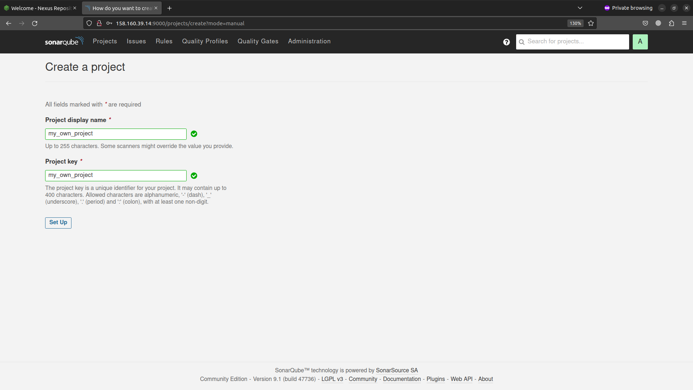
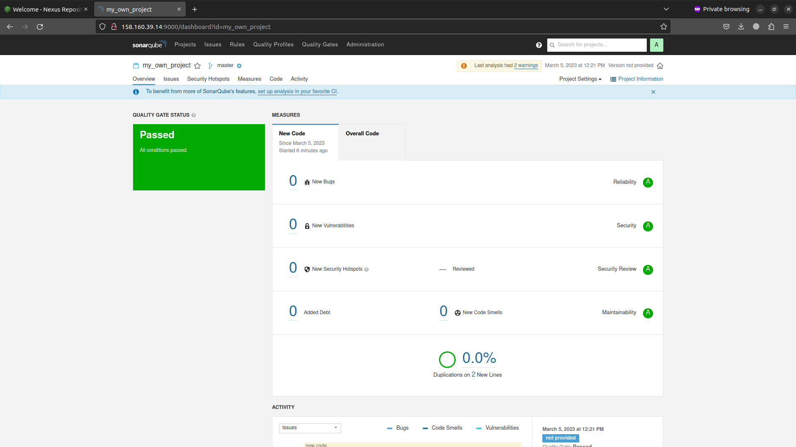
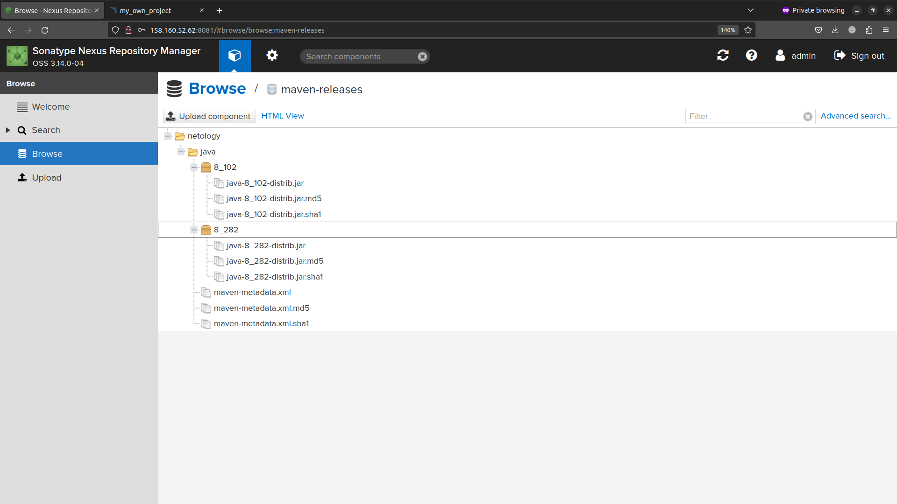

# Домашнее задание к занятию "9.Процессы CI/CD"

## Подготовка к выполнению

1. Создаём 2 VM в yandex cloud со следующими параметрами: 2CPU 4RAM Centos7(остальное по минимальным требованиям)
2. Прописываем в [inventory](./infrastructure/inventory/cicd/hosts.yml) [playbook'a](./infrastructure/site.yml) созданные хосты
3. Добавляем в [files](./infrastructure/files/) файл со своим публичным ключом (id_rsa.pub). Если ключ называется иначе - найдите таску в плейбуке, которая использует id_rsa.pub имя и исправьте на своё
4. Запускаем playbook, ожидаем успешного завершения
5. Проверяем готовность Sonarqube через [браузер](http://localhost:9000)
6. Заходим под admin\admin, меняем пароль на свой
7.  Проверяем готовность Nexus через [бразуер](http://localhost:8081)
8. Подключаемся под admin\admin123, меняем пароль, сохраняем анонимный доступ


  "nexus-01 : 158.160.52.62",


  "sonarqube-01 : 158.160.39.14",
  * admin:Q1w2e3r4?
  * admin: ca9a3d66de78ac67763d2dab5a68d890f82b5a81


## Знакомоство с SonarQube

### Основная часть

1. Создаём новый проект, название произвольное



2. Скачиваем пакет sonar-scanner, который нам предлагает скачать сам sonarqube
3. Делаем так, чтобы binary был доступен через вызов в shell (или меняем переменную PATH или любой другой удобный вам способ)

```bash
$ cd sonar-scanner-4.8.0.2856-linux/bin/
$ export PATH=$PATH:$(pwd)
```

4. Проверяем `sonar-scanner --version`

```bash
$ sonar-scanner --version
INFO: Scanner configuration file: /home/marc/Downloads/sonar-scanner-4.8.0.2856-linux/conf/sonar-scanner.properties
INFO: Project root configuration file: NONE
INFO: SonarScanner 4.8.0.2856
INFO: Java 11.0.17 Eclipse Adoptium (64-bit)
INFO: Linux 5.19.0-35-generic amd64
```

5. Запускаем анализатор против кода из директории [example](./example) с дополнительным ключом `-Dsonar.coverage.exclusions=fail.py`

```bash
$ sonar-scanner   -Dsonar.projectKey=my_own_project   -Dsonar.sources=.   -Dsonar.host.url=http://158.160.39.14:9000   -Dsonar.login=ca9a3d66de78ac67763d2dab5a68d890f82b5a81 -Dsonar.coverage.exclusions=fail.py
INFO: Scanner configuration file: /media/marc/Storage/Study/Netology/netology_homework/mnt-homeworks/09-ci-03-cicd/sonar-scanner-4.8.0.2856-linux/conf/sonar-scanner.properties
INFO: Project root configuration file: NONE
INFO: SonarScanner 4.8.0.2856
INFO: Java 11.0.17 Eclipse Adoptium (64-bit)
INFO: Linux 5.19.0-35-generic amd64
INFO: User cache: /home/marc/.sonar/cache
INFO: Analyzing on SonarQube server 9.1.0
INFO: Default locale: "en_US", source code encoding: "UTF-8" (analysis is platform dependent)
INFO: Load global settings
INFO: Load global settings (done) | time=101ms
INFO: Server id: 9CFC3560-AYaw9j8wnAS6RJZ25Pzw
INFO: User cache: /home/marc/.sonar/cache
INFO: Load/download plugins
INFO: Load plugins index
INFO: Load plugins index (done) | time=59ms
INFO: Load/download plugins (done) | time=15391ms
INFO: Process project properties
INFO: Process project properties (done) | time=6ms
INFO: Execute project builders
INFO: Execute project builders (done) | time=1ms
INFO: Project key: my_own_project
INFO: Base dir: /media/marc/Storage/Study/Netology/netology_homework/mnt-homeworks/09-ci-03-cicd/example
INFO: Working dir: /media/marc/Storage/Study/Netology/netology_homework/mnt-homeworks/09-ci-03-cicd/example/.scannerwork
INFO: Load project settings for component key: 'my_own_project'
INFO: Load project settings for component key: 'my_own_project' (done) | time=59ms
INFO: Load quality profiles
INFO: Load quality profiles (done) | time=99ms
INFO: Load active rules
INFO: Load active rules (done) | time=3224ms
INFO: Indexing files...
INFO: Project configuration:
INFO:   Excluded sources for coverage: fail.py
INFO: 1 file indexed
INFO: 0 files ignored because of scm ignore settings
INFO: Quality profile for py: Sonar way
INFO: ------------- Run sensors on module my_own_project
INFO: Load metrics repository
INFO: Load metrics repository (done) | time=33ms
INFO: Sensor Python Sensor [python]
WARN: Your code is analyzed as compatible with python 2 and 3 by default. This will prevent the detection of issues specific to python 2 or python 3. You can get a more precise analysis by setting a python version in your configuration via the parameter "sonar.python.version"
INFO: Starting global symbols computation
INFO: 1 source file to be analyzed
INFO: Load project repositories
INFO: Load project repositories (done) | time=31ms
INFO: 1/1 source file has been analyzed
INFO: Starting rules execution
INFO: 1 source file to be analyzed
INFO: 1/1 source file has been analyzed
INFO: Sensor Python Sensor [python] (done) | time=530ms
INFO: Sensor Cobertura Sensor for Python coverage [python]
INFO: Sensor Cobertura Sensor for Python coverage [python] (done) | time=8ms
INFO: Sensor PythonXUnitSensor [python]
INFO: Sensor PythonXUnitSensor [python] (done) | time=2ms
INFO: Sensor CSS Rules [cssfamily]
INFO: No CSS, PHP, HTML or VueJS files are found in the project. CSS analysis is skipped.
INFO: Sensor CSS Rules [cssfamily] (done) | time=1ms
INFO: Sensor JaCoCo XML Report Importer [jacoco]
INFO: 'sonar.coverage.jacoco.xmlReportPaths' is not defined. Using default locations: target/site/jacoco/jacoco.xml,target/site/jacoco-it/jacoco.xml,build/reports/jacoco/test/jacocoTestReport.xml
INFO: No report imported, no coverage information will be imported by JaCoCo XML Report Importer
INFO: Sensor JaCoCo XML Report Importer [jacoco] (done) | time=2ms
INFO: Sensor C# Project Type Information [csharp]
INFO: Sensor C# Project Type Information [csharp] (done) | time=1ms
INFO: Sensor C# Analysis Log [csharp]
INFO: Sensor C# Analysis Log [csharp] (done) | time=7ms
INFO: Sensor C# Properties [csharp]
INFO: Sensor C# Properties [csharp] (done) | time=0ms
INFO: Sensor JavaXmlSensor [java]
INFO: Sensor JavaXmlSensor [java] (done) | time=1ms
INFO: Sensor HTML [web]
INFO: Sensor HTML [web] (done) | time=2ms
INFO: Sensor VB.NET Project Type Information [vbnet]
INFO: Sensor VB.NET Project Type Information [vbnet] (done) | time=0ms
INFO: Sensor VB.NET Analysis Log [vbnet]
INFO: Sensor VB.NET Analysis Log [vbnet] (done) | time=9ms
INFO: Sensor VB.NET Properties [vbnet]
INFO: Sensor VB.NET Properties [vbnet] (done) | time=0ms
INFO: ------------- Run sensors on project
INFO: Sensor Zero Coverage Sensor
INFO: Sensor Zero Coverage Sensor (done) | time=0ms
INFO: SCM Publisher SCM provider for this project is: git
INFO: SCM Publisher 1 source file to be analyzed
INFO: SCM Publisher 0/1 source files have been analyzed (done) | time=46ms
WARN: Missing blame information for the following files:
WARN:   * fail.py
WARN: This may lead to missing/broken features in SonarQube
INFO: CPD Executor Calculating CPD for 1 file
INFO: CPD Executor CPD calculation finished (done) | time=17ms
INFO: Analysis report generated in 61ms, dir size=103.3 kB
INFO: Analysis report compressed in 39ms, zip size=14.3 kB
INFO: Analysis report uploaded in 59ms
INFO: ANALYSIS SUCCESSFUL, you can browse http://158.160.39.14:9000/dashboard?id=my_own_project
INFO: Note that you will be able to access the updated dashboard once the server has processed the submitted analysis report
INFO: More about the report processing at http://158.160.39.14:9000/api/ce/task?id=AYaxDxCunAS6RJZ25U43
INFO: Analysis total time: 5.368 s
INFO: ------------------------------------------------------------------------
INFO: EXECUTION SUCCESS
INFO: ------------------------------------------------------------------------
INFO: Total time: 21.431s
INFO: Final Memory: 8M/34M
INFO: ------------------------------------------------------------------------
```

6. Смотрим результат в интерфейсе


7. Исправляем ошибки, которые он выявил(включая warnings)
8. Запускаем анализатор повторно - проверяем, что QG пройдены успешно
9. Делаем скриншот успешного прохождения анализа, прикладываем к решению ДЗ



## Знакомство с Nexus

### Основная часть

1. В репозиторий `maven-public` загружаем артефакт с GAV параметрами:
   1. groupId: netology
   2. artifactId: java
   3. version: 8_282
   4. classifier: distrib
   5. type: tar.gz
2. В него же загружаем такой же артефакт, но с version: 8_102
3. Проверяем, что все файлы загрузились успешно



4. В ответе присылаем файл `maven-metadata.xml` для этого артефекта

[maven-metadata.xml](./mvn/maven-metadata.xml)

### Знакомство с Maven

### Подготовка к выполнению

1. Скачиваем дистрибутив с [maven](https://maven.apache.org/download.cgi)
2. Разархивируем, делаем так, чтобы binary был доступен через вызов в shell (или меняем переменную PATH или любой другой удобный вам способ)
3. Удаляем из `apache-maven-<version>/conf/settings.xml` упоминание о правиле, отвергающем http соединение( раздел mirrors->id: my-repository-http-unblocker)
4. Проверяем `mvn --version`

```bash
$ mvn --version
Apache Maven 3.9.0 (9b58d2bad23a66be161c4664ef21ce219c2c8584)
Maven home: /media/marc/Storage/Study/Netology/netology_homework/mnt-homeworks/09-ci-03-cicd/apache-maven-3.9.0
Java version: 11.0.18, vendor: Ubuntu, runtime: /usr/lib/jvm/java-11-openjdk-amd64
Default locale: en_US, platform encoding: UTF-8
OS name: "linux", version: "5.19.0-35-generic", arch: "amd64", family: "unix"
```

5. Забираем директорию [mvn](./mvn) с pom

### Основная часть

1. Меняем в `pom.xml` блок с зависимостями под наш артефакт из первого пункта задания для Nexus (java с версией 8_282)
2. Запускаем команду `mvn package` в директории с `pom.xml`, ожидаем успешного окончания

```
...
[INFO] ------------------------------------------------------------------------
[INFO] BUILD SUCCESS
[INFO] ------------------------------------------------------------------------
[INFO] Total time:  15.373 s
[INFO] Finished at: 2023-03-05T13:16:41+03:00
[INFO] ------------------------------------------------------------------------
```

3. Проверяем директорию `~/.m2/repository/`, находим наш [артефакт](./8_282)
4. В ответе присылаем исправленный файл `pom.xml`
[pom.xml](./mvn/pom.xml)


