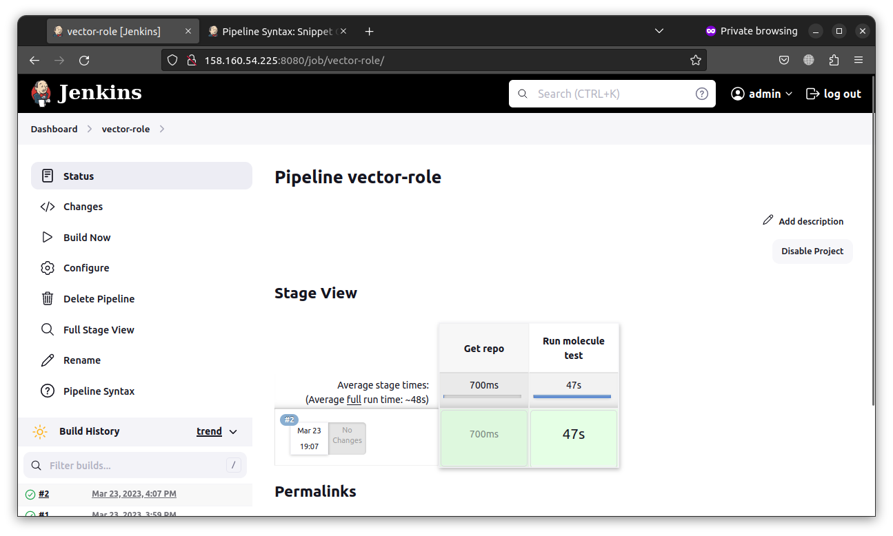

# Домашнее задание к занятию "10.Jenkins"

## Подготовка к выполнению

1. Создать 2 VM: для jenkins-master и jenkins-agent.
2. Установить jenkins при помощи playbook'a.
3. Запустить и проверить работоспособность.
4. Сделать первоначальную настройку.

## Основная часть

1. Сделать Freestyle Job, который будет запускать `molecule test` из любого вашего репозитория с ролью.


2. Сделать Declarative Pipeline Job, который будет запускать `molecule test` из любого вашего репозитория с ролью.



Pipeline:
```
pipeline {
    agent any

    stages {
        stage('Get repo') {
            steps {
                git branch: 'main', url: 'https://github.com/marc010/vector-role.git'
            }
        }        
        stage('Run molecule test') {
            steps {
                sh 'molecule test -s ubuntu_latest'
            }
        }
    }
}
```

3. Перенести Declarative Pipeline в репозиторий в файл `Jenkinsfile`.
4. Создать Multibranch Pipeline на запуск `Jenkinsfile` из репозитория.


5. Создать Scripted Pipeline, наполнить его скриптом из [pipeline](./pipeline).
6. Внести необходимые изменения, чтобы Pipeline запускал `ansible-playbook` без флагов `--check --diff`, если не установлен параметр при запуске джобы (prod_run = True), по умолчанию параметр имеет значение False и запускает прогон с флагами `--check --diff`.

Pipeline:

```
node("linux"){
    stage("Git checkout"){
        git 'https://github.com/aragastmatb/example-playbook.git'
    }
    stage("Sample define secret_check"){
        secret_check=true
    }
    stage("Run playbook"){
        if ("${prod_run}" == "True"){
            sh 'ansible-playbook -i inventory/prod.yml site.yml'
        }
        else{
            sh 'ansible-playbook -i inventory/prod.yml site.yml --check --diff'
        }
    }
}
```


7. Проверить работоспособность, исправить ошибки, исправленный Pipeline вложить в репозиторий в файл `ScriptedJenkinsfile`.
8. Отправить ссылку на репозиторий с ролью и Declarative Pipeline и Scripted Pipeline.

[Репозиторий](https://github.com/marc010/vector-role)