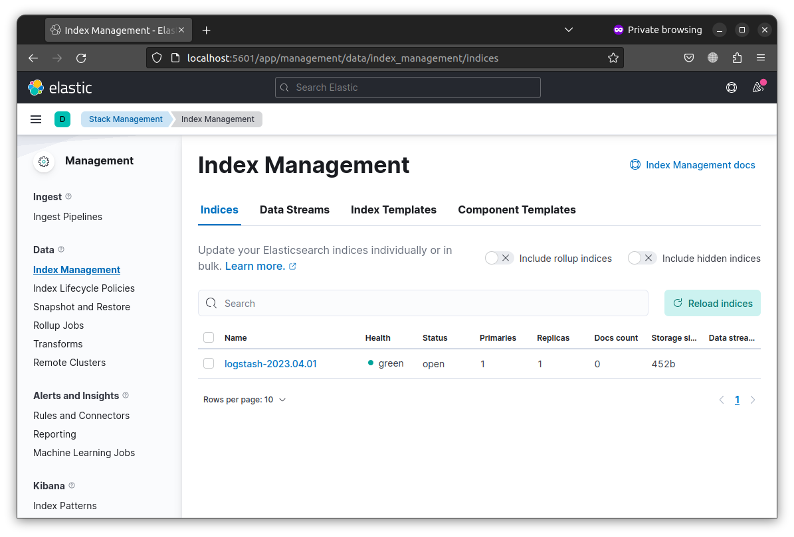
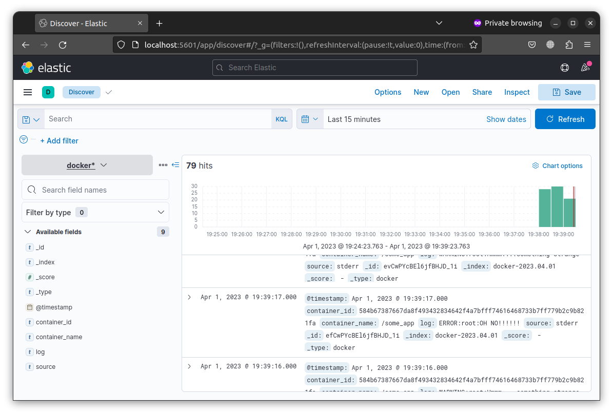
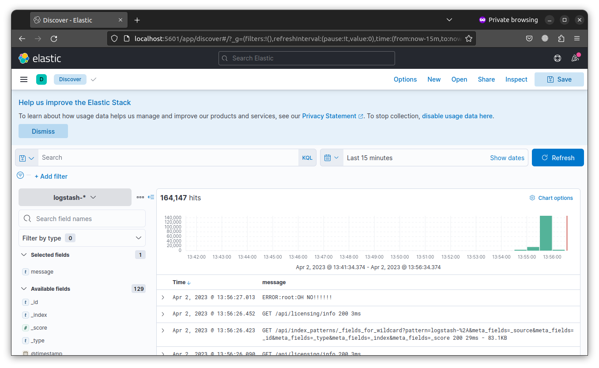
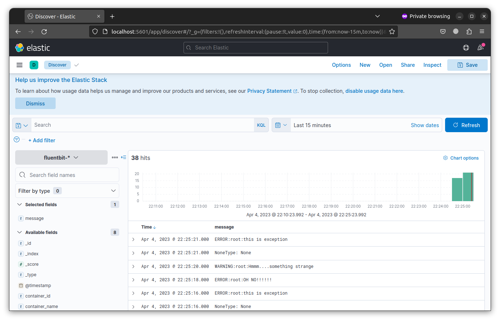

# Домашнее задание к занятию "15.Система сбора логов Elastic Stack"

## Дополнительные ссылки

При выполнении задания пользуйтесь вспомогательными ресурсами:

- [поднимаем elk в докер](https://www.elastic.co/guide/en/elastic-stack-get-started/current/get-started-docker.html)
- [поднимаем elk в докер с filebeat и докер логами](https://www.sarulabs.com/post/5/2019-08-12/sending-docker-logs-to-elasticsearch-and-kibana-with-filebeat.html)
- [конфигурируем logstash](https://www.elastic.co/guide/en/logstash/current/configuration.html)
- [плагины filter для logstash](https://www.elastic.co/guide/en/logstash/current/filter-plugins.html)
- [конфигурируем filebeat](https://www.elastic.co/guide/en/beats/libbeat/5.3/config-file-format.html)
- [привязываем индексы из elastic в kibana](https://www.elastic.co/guide/en/kibana/current/index-patterns.html)
- [как просматривать логи в kibana](https://www.elastic.co/guide/en/kibana/current/discover.html)
- [решение ошибки increase vm.max_map_count elasticsearch](https://stackoverflow.com/questions/42889241/how-to-increase-vm-max-map-count)

В процессе выполнения задания могут возникнуть также не указанные тут проблемы в зависимости от системы.

Используйте output stdout filebeat/kibana и api elasticsearch для изучения корня проблемы и ее устранения.

## Задание повышенной сложности

Не используйте директорию [help](./help) при выполнении домашнего задания.

## Задание 1

Вам необходимо поднять в докере:
- elasticsearch(hot и warm ноды)
- logstash
- kibana
- filebeat

и связать их между собой.

Logstash следует сконфигурировать для приёма по tcp json сообщений.

Filebeat следует сконфигурировать для отправки логов docker вашей системы в logstash.

В директории [help](./help) находится манифест docker-compose и конфигурации filebeat/logstash для быстрого 
выполнения данного задания.

Результатом выполнения данного задания должны быть:
- скриншот `docker ps` через 5 минут после старта всех контейнеров (их должно быть 5)

```bash
$ docker ps
CONTAINER ID   IMAGE                   COMMAND                  CREATED         STATUS         PORTS                                                                                                    NAMES
81175c2081b7   python:3.9-alpine       "python3 /opt/run.py"    5 minutes ago   Up 5 minutes                                                                                                            some_app
1a633611a368   kibana:7.17.9           "/bin/tini -- /usr/l…"   5 minutes ago   Up 5 minutes   0.0.0.0:5601->5601/tcp, :::5601->5601/tcp                                                                kibana
83bcc2e12fb5   fluent/fluent-bit:1.8   "/fluent-bit/bin/flu…"   5 minutes ago   Up 5 minutes   2020/tcp, 0.0.0.0:24224->24224/tcp, 0.0.0.0:24224->24224/udp, :::24224->24224/tcp, :::24224->24224/udp   fluent-bit
50944a16ae09   elasticsearch:7.17.9    "/bin/tini -- /usr/l…"   5 minutes ago   Up 5 minutes   0.0.0.0:9200->9200/tcp, :::9200->9200/tcp, 0.0.0.0:9300->9300/tcp, :::9300->9300/tcp                     es-hot
dcc1545c5a58   elasticsearch:7.17.9    "/bin/tini -- /usr/l…"   5 minutes ago   Up 5 minutes   9200/tcp, 9300/tcp 
```

- скриншот интерфейса kibana



- docker-compose манифест (если вы не использовали директорию help)

[docker-compose](./filebeat_logstash/docker-compose.yml) - filebeat, logstash, es-hot, es-warm, kibana, some_app;

[docker-compose](./fluent-bit/docker-compose.yml)  - fluent-bit, es-hot, es-warm, kibana, some_app;

- ваши yml конфигурации для стека (если вы не использовали директорию help)


## Задание 2

Перейдите в меню [создания index-patterns  в kibana](http://localhost:5601/app/management/kibana/indexPatterns/create)
и создайте несколько index-patterns из имеющихся.

Перейдите в меню просмотра логов в kibana (Discover) и самостоятельно изучите как отображаются логи и как производить 
поиск по логам.

fluent-bit:




filebeat:



fluent-bit с полем `message` вместо `log`:



В манифесте директории help также приведенно dummy приложение, которое генерирует рандомные события в stdout контейнера.
Данные логи должны порождать индекс logstash-* в elasticsearch. Если данного индекса нет - воспользуйтесь советами 
и источниками из раздела "Дополнительные ссылки" данного ДЗ.

 
