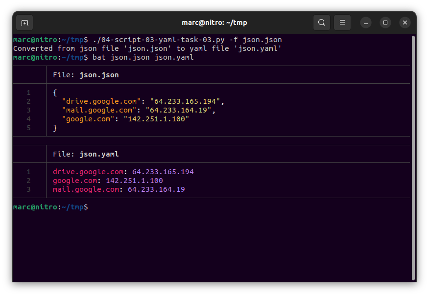
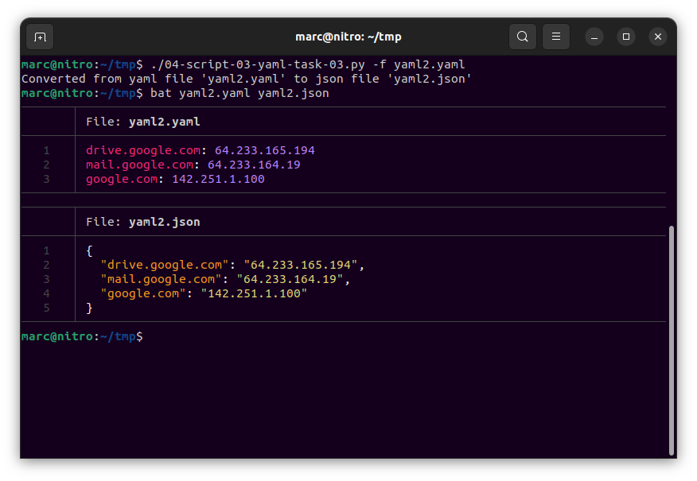
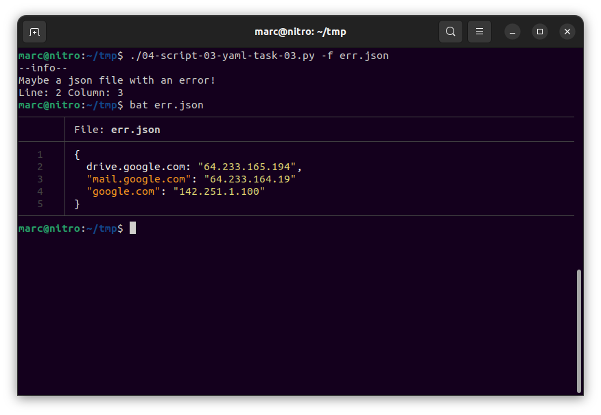
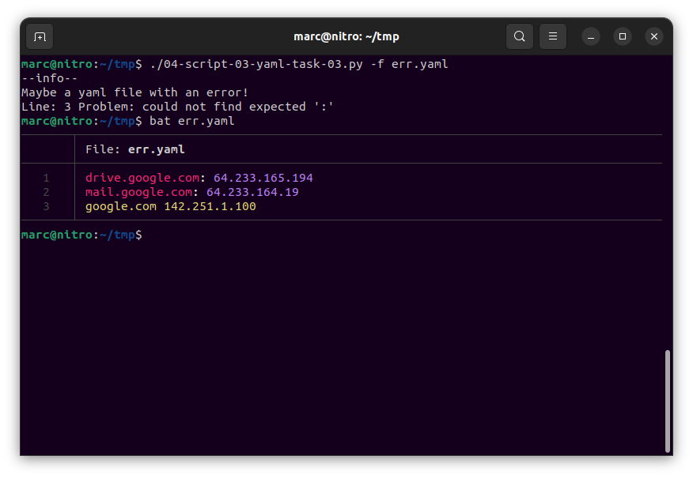
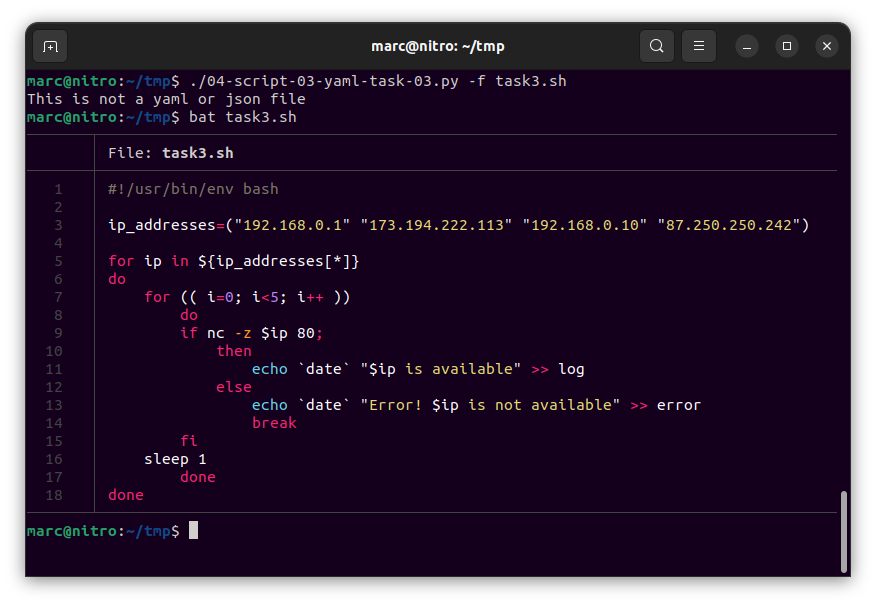

# Домашнее задание к занятию "4.3. Языки разметки JSON и YAML"


## Обязательная задача 1
Мы выгрузили JSON, который получили через API запрос к нашему сервису:
```
    { "info" : "Sample JSON output from our service\t",
        "elements" :[
            { "name" : "first",
            "type" : "server",
            "ip" : 7175 
            }
            { "name" : "second",
            "type" : "proxy",
            "ip : 71.78.22.43
            }
        ]
    }
```
  Нужно найти и исправить все ошибки, которые допускает наш сервис

  Исправленный JSON
* Желательны пробелы после символа `:` (строка 2)
* Вопрос к формату ip адреса в десятичном виде это не ошбика, но если выводить в "стандартной" форме, то необходимы кавычки (строка 5)
* Пропущена запятая (строка 6)
* Не хватает символа открывающейся кавычки у ключа `ip` (строка 9)
* Значение ip адреса должно бвть в кавычках (строка 9)

```
   1   │ { "info" : "Sample JSON output from our service\t",
   2   │     "elements" : [
   3   │         { "name" : "first",
   4   │         "type" : "server",
   5   │         "ip" : 7175
   6   │         },
   7   │         { "name" : "second",
   8   │         "type" : "proxy",
   9   │         "ip" : "71.78.22.43"
  10   │         }
  11   │     ]
  12   │ }
```

## Обязательная задача 2
В прошлый рабочий день мы создавали скрипт, позволяющий опрашивать веб-сервисы и получать их IP. К уже реализованному функционалу нам нужно добавить возможность записи JSON и YAML файлов, описывающих наши сервисы. Формат записи JSON по одному сервису: `{ "имя сервиса" : "его IP"}`. Формат записи YAML по одному сервису: `- имя сервиса: его IP`. Если в момент исполнения скрипта меняется IP у сервиса - он должен так же поменяться в yml и json файле.

### Ваш скрипт:
```python
#!/usr/bin/env python3

import socket
import time
import json
import yaml

server_names = {"drive.google.com": "", "mail.google.com": "", "google.com": ""}

def create_json(service):
    with open("services.json", "w") as js_file:
        js_file.write(json.dumps(service, indent=2))

def create_yaml(service):
    with open("services.yaml", "w") as yaml_file:
        # yaml_file.write(yaml.safe_dump(service, indent=2))
        for dns, ip in service.items():
            yaml.safe_dump([{dns: ip}], yaml_file, indent=2)

# Первоначальное заполнение
for dns in server_names.keys():
    try:
        ip = socket.gethostbyname(dns)
        server_names[dns] = ip
    except socket.gaierror:
        print(f"[!] Error Name or service not known: {dns}")
        server_names[dns] = "0.0.0.0"
create_json(server_names)
create_yaml(server_names)

while True:
    for dns in server_names.keys():
        try:
            ip = socket.gethostbyname(dns)
            if server_names[dns] == ip:
                print(dns, '-', ip)
            else:
                print(f"[ERROR] {dns} IP mismatch: {server_names[dns]} {ip}")
                print(dns, '-', ip)
                server_names[dns] = ip
        except socket.gaierror:
            print(f"[!] Error Name or service not known: {dns}")
            server_names[dns] = "0.0.0.0"
    print("__________________________________________")
    create_json(server_names)
    create_yaml(server_names)
    time.sleep(2)
```

### Вывод скрипта при запуске при тестировании:
```
drive.google.com - 64.233.165.194
[ERROR] mail.google.com IP mismatch: 64.233.164.18 64.233.164.83
mail.google.com - 64.233.164.83
google.com - 142.251.1.139
__________________________________________
drive.google.com - 64.233.165.194
mail.google.com - 64.233.164.83
google.com - 142.251.1.139
__________________________________________
drive.google.com - 64.233.165.194
[ERROR] mail.google.com IP mismatch: 64.233.164.83 64.233.164.19
mail.google.com - 64.233.164.19
[ERROR] google.com IP mismatch: 142.251.1.139 142.251.1.100
google.com - 142.251.1.100
__________________________________________
```

### json-файл(ы), который(е) записал ваш скрипт:
```json
{
  "drive.google.com": "64.233.165.194",
  "mail.google.com": "64.233.164.19",
  "google.com": "142.251.1.100"
}
```

### yml-файл(ы), который(е) записал ваш скрипт:
```yaml
- drive.google.com: 64.233.165.194
- mail.google.com: 64.233.164.19
- google.com: 142.251.1.100
```

## Дополнительное задание (со звездочкой*) - необязательно к выполнению

Так как команды в нашей компании никак не могут прийти к единому мнению о том, какой формат разметки данных использовать: JSON или YAML, нам нужно реализовать парсер из одного формата в другой. Он должен уметь:
   * Принимать на вход имя файла
   * Проверять формат исходного файла. Если файл не json или yml - скрипт должен остановить свою работу
   * Распознавать какой формат данных в файле. Считается, что файлы *.json и *.yml могут быть перепутаны
   * Перекодировать данные из исходного формата во второй доступный (из JSON в YAML, из YAML в JSON)
   * При обнаружении ошибки в исходном файле - указать в стандартном выводе строку с ошибкой синтаксиса и её номер
   * Полученный файл должен иметь имя исходного файла, разница в наименовании обеспечивается разницей расширения файлов

### Ваш скрипт:
```python
#!/usr/bin/env python3

import os
import argparse
import json
import yaml

parser = argparse.ArgumentParser(
    description="This program converts json to yaml and vice versa. A file is saved with the json or yaml extension. if the file with that name exists, the program will overwrite it.",
    usage="%(prog)s [options <args>]")
parser.add_argument('-f', "--file", help="add path to json or yaml file")
args = parser.parse_args()


def check_file_type(data):
    try:
        json_data = json.loads(data)
        from_dict_to_file(json_data, "json")

    except json.decoder.JSONDecodeError as json_er:
        if json_er.msg == "Expecting value" and json_er.lineno == 1 and json_er.colno == 1:  # maybe it's not a json file
            try:
                yaml_data = yaml.safe_load(data)
                if type(yaml_data) is dict:
                    from_dict_to_file(yaml_data, "yaml")  # add call function yaml to json
                else:
                    print("This is not a yaml or json file")

            except yaml.YAMLError as yaml_er:
                if yaml_er.args[1] is None:
                    print("This is not a yaml or json file")
                else:  # yaml with a mistake

                    print("--info--\nMaybe a yaml file with an error!")
                    print(f"Line: {yaml_er.context_mark.line + 1} Problem: {yaml_er.problem}")

        else:  # it is possible json with mistakes
            print("--info--\nMaybe a json file with an error!")
            print(f"Line: {json_er.lineno} Column: {json_er.colno}")


def from_dict_to_file(data, extension):
    file_name = args.file
    if extension == "yaml":
        if file_name.rfind(".yaml") != -1:
            file_name = file_name[:file_name.rfind(".yaml")] + ".json"
        else:
            file_name = file_name + ".json"
        with open(file_name, "w") as json_file:
            json_file.write(json.dumps(data, indent=2))
        print(f"Converted from yaml file '{args.file}' to json file '{file_name}'")
    elif extension == "json":
        if file_name.rfind(".json") != -1:
            file_name = file_name[:file_name.rfind(".json")] + ".yaml"
        else:
            file_name = file_name + ".yaml"
        with open(file_name, "w") as yaml_file:
            yaml_file.write(yaml.dump(data, indent=2))
        print(f"Converted from json file '{args.file}' to yaml file '{file_name}'")


if args.file is None:
    parser.print_help()
    exit()  # while there are no other options
else:
    if os.path.isfile(args.file):
        with open(args.file, "r") as file:
            data = file.read()
        check_file_type(data)
    else:
        print(f"File '{args.file}' doesn't exist!")

```

### Пример работы скрипта:

#### Из json в yaml:



#### Из yaml в json:



#### Ошибка в json файле 



#### Ошибка в yaml файле 



#### Не json и не yaml

