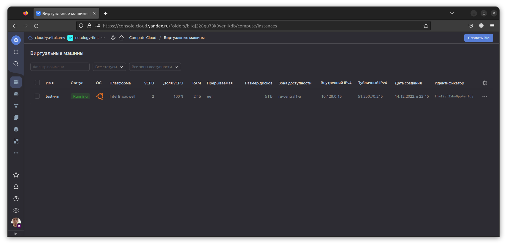

# Домашнее задание к занятию "7.2. Облачные провайдеры и синтаксис Terraform."

## Задача 1 (Вариант с Yandex.Cloud). Регистрация в ЯО и знакомство с основами (необязательно, но крайне желательно).

1. Подробная инструкция на русском языке содержится [здесь](https://cloud.yandex.ru/docs/solutions/infrastructure-management/terraform-quickstart).
2. Обратите внимание на период бесплатного использования после регистрации аккаунта. 
3. Используйте раздел "Подготовьте облако к работе" для регистрации аккаунта. Далее раздел "Настройте провайдер" для подготовки
базового терраформ конфига.
4. Воспользуйтесь [инструкцией](https://registry.terraform.io/providers/yandex-cloud/yandex/latest/docs) на сайте терраформа, что бы 
не указывать авторизационный токен в коде, а терраформ провайдер брал его из переменных окружений.

```bash
$ export YC_TOKEN=$(yc iam create-token)
$ export YC_CLOUD_ID=$(yc config get cloud-id)
$ export YC_FOLDER_ID=$(yc config get folder-id)
```

## Задача 2. Создание aws ec2 или yandex_compute_instance через терраформ. 

1. В каталоге `terraform` вашего основного репозитория, который был создан в начале курсе, создайте файл `main.tf` и `versions.tf`.

```bash
$ touch versions.tf main.tf
```

2. Зарегистрируйте провайдер 
   1. для [aws](https://registry.terraform.io/providers/hashicorp/aws/latest/docs). В файл `main.tf` добавьте
   блок `provider`, а в `versions.tf` блок `terraform` с вложенным блоком `required_providers`. Укажите любой выбранный вами регион 
   внутри блока `provider`.
   2. либо для [yandex.cloud](https://registry.terraform.io/providers/yandex-cloud/yandex/latest/docs). Подробную инструкцию можно найти 
   [здесь](https://cloud.yandex.ru/docs/solutions/infrastructure-management/terraform-quickstart). 


Указываем источник, из которого будет устанавливаться провайдер:
```bash
$ cat ~/.terraformrc 
provider_installation {
  network_mirror {
    url = "https://terraform-mirror.yandexcloud.net/"
    include = ["registry.terraform.io/*/*"]
  }
  direct {
    exclude = ["registry.terraform.io/*/*"]
  }
}
```

```bash
$ batcat main.tf versions.tf 
───────┬───────────────────────────────────────────────────────────────────────────────────────────
       │ File: main.tf
───────┼───────────────────────────────────────────────────────────────────────────────────────────
   1   │ provider "yandex" {
   2   │   zone = "ru-central1-a"
   3   │ }
───────┴───────────────────────────────────────────────────────────────────────────────────────────
───────┬───────────────────────────────────────────────────────────────────────────────────────────
       │ File: versions.tf
───────┼───────────────────────────────────────────────────────────────────────────────────────────
   1   │ terraform {
   2   │   required_providers {
   3   │     yandex = {
   4   │       source = "yandex-cloud/yandex"
   5   │     }
   6   │   }
   7   │   required_version = ">= 0.13"
   8   │ }
```
Инициализируем терраформ:
```bash
$ terraform init
```

3. Внимание! В гит репозиторий нельзя пушить ваши личные ключи доступа к аккаунту. Поэтому в предыдущем задании мы указывали
их в виде переменных окружения. 
4. В файле `main.tf` воспользуйтесь блоком `data "aws_ami` для поиска ami образа последнего Ubuntu.

```bash
$ yc compute image get-latest-from-family ubuntu-2204-lts --folder-id standard-images
id: fd864gbboths76r8gm5f
folder_id: standard-images
created_at: "2022-12-14T13:47:52Z"
name: ubuntu-22-04-lts-v20221214
description: ubuntu 22.04 lts
family: ubuntu-2204-lts
storage_size: "4957667328"
min_disk_size: "5368709120"
product_ids:
  - f2eafokver0c6udimvtc
status: READY
os:
  type: LINUX
pooled: true
```
Здесь интересует поле `id: fd864gbboths76r8gm5f`

5. В файле `main.tf` создайте рессурс 
   1. либо [ec2 instance](https://registry.terraform.io/providers/hashicorp/aws/latest/docs/resources/instance).
   Постарайтесь указать как можно больше параметров для его определения. Минимальный набор параметров указан в первом блоке 
   `Example Usage`, но желательно, указать большее количество параметров.
   2. либо [yandex_compute_image](https://registry.terraform.io/providers/yandex-cloud/yandex/latest/docs/resources/compute_image).

main.tf:
```
provider "yandex" {
  zone = "ru-central1-a"
}
resource "yandex_compute_instance" "netology-first" {
  name = "test-vm"
  resources {
    cores = 2
    memory = 2
  }
  boot_disk {
    initialize_params {
      image_id = "fd864gbboths76r8gm5f"
    }
  }
  network_interface {
    subnet_id = "e9becg8tafkc48jn84ls" 
    nat = true
  }
  metadata = {
    ssh-keys = "ubuntu:${file("~/.ssh/id_rsa.pub")}"
  }
}
output "internal_ip_address_test_vm" {
  value = yandex_compute_instance.netology-first.network_interface.0.ip_address
}
output "external_ip_address_test_vm" {
  value = yandex_compute_instance.netology-first.network_interface.0.nat_ip_address
}
```

6. Также в случае использования aws:
   1. Добавьте data-блоки `aws_caller_identity` и `aws_region`.
   2. В файл `outputs.tf` поместить блоки `output` с данными об используемых в данный момент: 
       * AWS account ID,
       * AWS user ID,
       * AWS регион, который используется в данный момент, 
       * Приватный IP ec2 инстансы,
       * Идентификатор подсети в которой создан инстанс.  

```bash
$ terraform validate
Success! The configuration is valid.
```
Проверяем ресурсы:
```bash
$ terraform plan
```

7. Если вы выполнили первый пункт, то добейтесь того, что бы команда `terraform plan` выполнялась без ошибок. 

```bash
$ terraform apply
...
Outputs:

external_ip_address_test_vm = "51.250.70.245"
internal_ip_address_test_vm = "10.128.0.15"
```



В качестве результата задания предоставьте:
1. Ответ на вопрос: при помощи какого инструмента (из разобранных на прошлом занятии) можно создать свой образ ami?

### Packer

2. Ссылку на репозиторий с исходной конфигурацией [терраформа.](./terraform/)  

