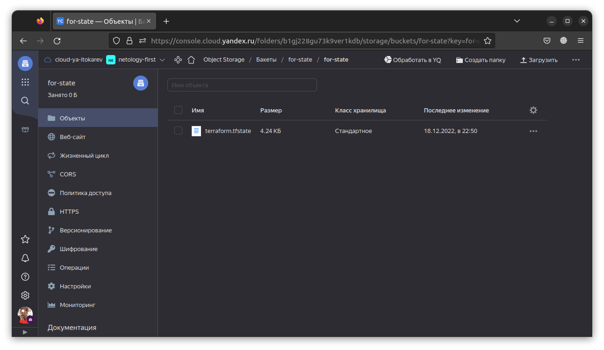

# Домашнее задание к занятию "7.3. Основы и принцип работы Терраформ"

## Задача 1. Создадим бэкэнд в S3 (необязательно, но крайне желательно).

Если в рамках предыдущего задания у вас уже есть аккаунт AWS, то давайте продолжим знакомство со взаимодействием
терраформа и aws. 

1. Создайте s3 бакет, iam роль и пользователя от которого будет работать терраформ. Можно создать отдельного пользователя,
а можно использовать созданного в рамках предыдущего задания, просто добавьте ему необходимы права, как описано 
[здесь](https://www.terraform.io/docs/backends/types/s3.html).
1. Зарегистрируйте бэкэнд в терраформ проекте как описано по ссылке выше. 

Решение:

1. Создадим файл конфигурации terraform:
* versions.tf
```
terraform {
  required_providers {
    yandex = {
      source = "yandex-cloud/yandex"
    }
  }
  required_version = ">= 0.13"
}
```
* main.tf
```
provider "yandex" {
  zone = var.yc_region
}
```

2. Инициализируем провайдера:
```bash
$ terraform init
```
3. Создадим бакет и сервисный аккаунт для работы с ним bucket.tf:

```
resource "yandex_iam_service_account" "sa" {
  name = "bucket-test"
}

resource "yandex_resourcemanager_folder_iam_member" "sa-editor" {
  folder_id = var.yc_folder_id 
  role = "storage.editor"
  member = "serviceAccount:${yandex_iam_service_account.sa.id}"
}

resource "yandex_iam_service_account_static_access_key" "sa-static-key" {
  service_account_id = yandex_iam_service_account.sa.id
  description = "static access key for object storage"
}

resource "yandex_storage_bucket" "netology-test" {
  access_key = yandex_iam_service_account_static_access_key.sa-static-key.access_key
  secret_key = yandex_iam_service_account_static_access_key.sa-static-key.secret_key
  bucket = "for-state"
}
```

4. Выполним `terraform apply` для создания бакета.

5.  Файл bucket.tf нам больше не нужен. Переименуем его `mv backet.tf bucket.bak`. Изменим файл versions.tf 
указав в нем бэкенд.

```
terraform {
  required_providers {
    yandex = {
      source = "yandex-cloud/yandex"
    }
  }

  required_version = ">= 0.13"

  backend "s3" {
    endpoint = "storage.yandexcloud.net"
    bucket = "for-state"
    region = "ru-central1"
    key = "for-state/terraform.tfstate"
    skip_region_validation = true
    skip_credentials_validation = true
  }
}
```
Создадим файл, в котором укажем секреты сервисного аккаунта для работы с бэкендом.

```bash
$ cat backend.cred 
access_key = ""
secret_key = ""
```

6 Инициализируем terraform для работы с бэкендом:

```bash
$ terraform init --backend-config=backend.cred
```

Ответ:



## Задача 2. Инициализируем проект и создаем воркспейсы. 

1. Выполните `terraform init`:
    * если был создан бэкэнд в S3, то терраформ создат файл стейтов в S3 и запись в таблице 
dynamodb.
    * иначе будет создан локальный файл со стейтами.  
1. Создайте два воркспейса `stage` и `prod`.

```bash
$ terraform workspace new stage
$ terraform workspace new prod
$ terraform workspace list
  default
* prod
  stage
```

3. В уже созданный `aws_instance` добавьте зависимость типа инстанса от вокспейса, что бы в разных ворскспейсах 
использовались разные `instance_type`.

*  Добавим в файл `variables.tf` соответствующие переменные:
```
locals {
  platform_id_type = {
    stage = "standard-v1"
    prod = "standard-v2"
  }
}
```

* Добавим в файл `main.tf` зависимость от типа платформы от вокспейса:

```
resource "yandex_compute_instance" "vm" {
  name = "vm"
  platform_id = local.platform_id_type[terraform.workspace]
}
```

4. Добавим `count`. Для `stage` должен создаться один экземпляр `ec2`, а для `prod` два. 

*  Добавим в файл `variables.tf` соответствующие переменные:

```
locals {
  vm_count = {
    stage = 1
    prod = 2
  }
}
```

* Добавим в файл `main.tf` зависимость количества ВМ от вокспейса:

```
resource "yandex_compute_instance" "vm-count" {
  count = local.vm_count[terraform.workspace]
  name = "${var.vm_name_pfx}-${count.index}"
  platform_id = local.platform_id_type[terraform.workspace]

  resources {
    cores = 2
    memory = 2
  }
  
  boot_disk {
    initialize_params {
      image_id = "${var.ubuntu22_id}"
    }
  }

  network_interface {
    subnet_id = "${var.subnet}"
    nat = true
  }

  metadata = {
    ssh-keys = "ubuntu:${file("~/.ssh/id_rsa.pub")}"
  }

}

output "internal_ip_address" {
  value = yandex_compute_instance.vm-count.*.network_interface.0.ip_address
}


output "external_ip_address" {
  value = yandex_compute_instance.vm-count.*.network_interface.0.nat_ip_address
}
```

5. Создайте рядом еще один `aws_instance`, но теперь определите их количество при помощи `for_each`, а не `count`.

* Добавим в файл variables.tf соответствующие переменные:

```
variable "vm_names" {
  type = map
  default = {
    vm1 = {
      name = "vm-1f"
    }
    vm2 = {
      name = "vm-2f"
    }
  }
}
```

* Добавим в файл `main.tf` описание ВМ через `for_each`

```
resource "yandex_compute_instance" "vm-foreach" {
  for_each = var.vm_names
  name = each.value.name
  platform_id = local.platform_id_type[terraform.workspace]

  resources {
    cores = 2
    memory = 2
  }
  
  boot_disk {
    initialize_params {
      image_id = "${var.ubuntu22_id}"
    }
  }

  network_interface {
    subnet_id = "${var.subnet}"
    nat = true
  }

  metadata = {
    ssh-keys = "ubuntu:${file("~/.ssh/id_rsa.pub")}"
  }

}

output "internal_ip_address_foreach" {
  value = values(yandex_compute_instance.vm-foreach).*.network_interface.0.ip_address
}

output "external_ip_address_foreach" {
  value = values(yandex_compute_instance.vm-foreach).*.network_interface.0.nat_ip_address
}
```

6. Что бы при изменении типа инстанса не возникло ситуации, когда не будет ни одного инстанса добавьте параметр
жизненного цикла `create_before_destroy = true` в один из рессурсов `aws_instance`.

Опишем соответствующий ресурс:

```
resource "yandex_compute_instance" "always-present-vm" {
  name = "vm100"
  resources {
    cores = 2
    memory = 2
  }

  lifecycle {
    create_before_destroy = true
  }

  boot_disk {
    initialize_params {
      image_id = "${var.ubuntu22_id}"
    }
  }

  network_interface {
    subnet_id = "${var.subnet}"
    nat = true
  }

  metadata = {
    ssh-keys = "ubuntu:${file("~/.ssh/id_rsa.pub")}"
  }
}
output "internal_ip_address_always_present_vm" {
  value = yandex_compute_instance.always-present-vm.network_interface.0.ip_address
}
output "external_ip_address_always_present_vm" {
  value = yandex_compute_instance.always-present-vm.network_interface.0.nat_ip_address
}
```

7. При желании поэкспериментируйте с другими параметрами и рессурсами.

В виде результата работы пришлите:
* Вывод команды `terraform workspace list`.

```bash
$ terraform workspace list
  default
* prod
  stage
```

* Вывод команды `terraform plan` для воркспейса `prod`.

```bash
$ terraform plan

Terraform used the selected providers to generate the following execution plan. Resource actions are indicated with the following
symbols:
  + create

Terraform will perform the following actions:

  # yandex_compute_instance.always-present-vm will be created
  + resource "yandex_compute_instance" "always-present-vm" {
      + created_at                = (known after apply)
      + folder_id                 = (known after apply)
      + fqdn                      = (known after apply)
      + hostname                  = (known after apply)
      + id                        = (known after apply)
      + metadata                  = {
          + "ssh-keys" = <<-EOT
                ubuntu:ssh-rsa "My ssh key"
            EOT
        }
      + name                      = "vm100"
      + network_acceleration_type = "standard"
      + platform_id               = "standard-v1"
      + service_account_id        = (known after apply)
      + status                    = (known after apply)
      + zone                      = (known after apply)

      + boot_disk {
          + auto_delete = true
          + device_name = (known after apply)
          + disk_id     = (known after apply)
          + mode        = (known after apply)

          + initialize_params {
              + block_size  = (known after apply)
              + description = (known after apply)
              + image_id    = "fd864gbboths76r8gm5f"
              + name        = (known after apply)
              + size        = (known after apply)
              + snapshot_id = (known after apply)
              + type        = "network-hdd"
            }
        }

      + metadata_options {
          + aws_v1_http_endpoint = (known after apply)
          + aws_v1_http_token    = (known after apply)
          + gce_http_endpoint    = (known after apply)
          + gce_http_token       = (known after apply)
        }

      + network_interface {
          + index              = (known after apply)
          + ip_address         = (known after apply)
          + ipv4               = true
          + ipv6               = (known after apply)
          + ipv6_address       = (known after apply)
          + mac_address        = (known after apply)
          + nat                = true
          + nat_ip_address     = (known after apply)
          + nat_ip_version     = (known after apply)
          + security_group_ids = (known after apply)
          + subnet_id          = "e9becg8tafkc48jn84ls"
        }

      + placement_policy {
          + host_affinity_rules = (known after apply)
          + placement_group_id  = (known after apply)
        }

      + resources {
          + core_fraction = 100
          + cores         = 2
          + memory        = 2
        }

      + scheduling_policy {
          + preemptible = (known after apply)
        }
    }

  # yandex_compute_instance.vm-count[0] will be created
  + resource "yandex_compute_instance" "vm-count" {
      + created_at                = (known after apply)
      + folder_id                 = (known after apply)
      + fqdn                      = (known after apply)
      + hostname                  = (known after apply)
      + id                        = (known after apply)
      + metadata                  = {
          + "ssh-keys" = <<-EOT
                ubuntu:ssh-rsa "My ssh key"
            EOT
        }
      + name                      = "netology-vm--0"
      + network_acceleration_type = "standard"
      + platform_id               = "standard-v2"
      + service_account_id        = (known after apply)
      + status                    = (known after apply)
      + zone                      = (known after apply)

      + boot_disk {
          + auto_delete = true
          + device_name = (known after apply)
          + disk_id     = (known after apply)
          + mode        = (known after apply)

          + initialize_params {
              + block_size  = (known after apply)
              + description = (known after apply)
              + image_id    = "fd864gbboths76r8gm5f"
              + name        = (known after apply)
              + size        = (known after apply)
              + snapshot_id = (known after apply)
              + type        = "network-hdd"
            }
        }

      + metadata_options {
          + aws_v1_http_endpoint = (known after apply)
          + aws_v1_http_token    = (known after apply)
          + gce_http_endpoint    = (known after apply)
          + gce_http_token       = (known after apply)
        }

      + network_interface {
          + index              = (known after apply)
          + ip_address         = (known after apply)
          + ipv4               = true
          + ipv6               = (known after apply)
          + ipv6_address       = (known after apply)
          + mac_address        = (known after apply)
          + nat                = true
          + nat_ip_address     = (known after apply)
          + nat_ip_version     = (known after apply)
          + security_group_ids = (known after apply)
          + subnet_id          = "e9becg8tafkc48jn84ls"
        }

      + placement_policy {
          + host_affinity_rules = (known after apply)
          + placement_group_id  = (known after apply)
        }

      + resources {
          + core_fraction = 100
          + cores         = 2
          + memory        = 2
        }

      + scheduling_policy {
          + preemptible = (known after apply)
        }
    }

  # yandex_compute_instance.vm-count[1] will be created
  + resource "yandex_compute_instance" "vm-count" {
      + created_at                = (known after apply)
      + folder_id                 = (known after apply)
      + fqdn                      = (known after apply)
      + hostname                  = (known after apply)
      + id                        = (known after apply)
      + metadata                  = {
          + "ssh-keys" = <<-EOT
                ubuntu:ssh-rsa "My ssh key"
            EOT
        }
      + name                      = "netology-vm--1"
      + network_acceleration_type = "standard"
      + platform_id               = "standard-v2"
      + service_account_id        = (known after apply)
      + status                    = (known after apply)
      + zone                      = (known after apply)

      + boot_disk {
          + auto_delete = true
          + device_name = (known after apply)
          + disk_id     = (known after apply)
          + mode        = (known after apply)

          + initialize_params {
              + block_size  = (known after apply)
              + description = (known after apply)
              + image_id    = "fd864gbboths76r8gm5f"
              + name        = (known after apply)
              + size        = (known after apply)
              + snapshot_id = (known after apply)
              + type        = "network-hdd"
            }
        }

      + metadata_options {
          + aws_v1_http_endpoint = (known after apply)
          + aws_v1_http_token    = (known after apply)
          + gce_http_endpoint    = (known after apply)
          + gce_http_token       = (known after apply)
        }

      + network_interface {
          + index              = (known after apply)
          + ip_address         = (known after apply)
          + ipv4               = true
          + ipv6               = (known after apply)
          + ipv6_address       = (known after apply)
          + mac_address        = (known after apply)
          + nat                = true
          + nat_ip_address     = (known after apply)
          + nat_ip_version     = (known after apply)
          + security_group_ids = (known after apply)
          + subnet_id          = "e9becg8tafkc48jn84ls"
        }

      + placement_policy {
          + host_affinity_rules = (known after apply)
          + placement_group_id  = (known after apply)
        }

      + resources {
          + core_fraction = 100
          + cores         = 2
          + memory        = 2
        }

      + scheduling_policy {
          + preemptible = (known after apply)
        }
    }

  # yandex_compute_instance.vm-foreach["vm1"] will be created
  + resource "yandex_compute_instance" "vm-foreach" {
      + created_at                = (known after apply)
      + folder_id                 = (known after apply)
      + fqdn                      = (known after apply)
      + hostname                  = (known after apply)
      + id                        = (known after apply)
      + metadata                  = {
          + "ssh-keys" = <<-EOT
                ubuntu:ssh-rsa "My ssh key"
            EOT
        }
      + name                      = "vm-1f"
      + network_acceleration_type = "standard"
      + platform_id               = "standard-v2"
      + service_account_id        = (known after apply)
      + status                    = (known after apply)
      + zone                      = (known after apply)

      + boot_disk {
          + auto_delete = true
          + device_name = (known after apply)
          + disk_id     = (known after apply)
          + mode        = (known after apply)

          + initialize_params {
              + block_size  = (known after apply)
              + description = (known after apply)
              + image_id    = "fd864gbboths76r8gm5f"
              + name        = (known after apply)
              + size        = (known after apply)
              + snapshot_id = (known after apply)
              + type        = "network-hdd"
            }
        }

      + metadata_options {
          + aws_v1_http_endpoint = (known after apply)
          + aws_v1_http_token    = (known after apply)
          + gce_http_endpoint    = (known after apply)
          + gce_http_token       = (known after apply)
        }

      + network_interface {
          + index              = (known after apply)
          + ip_address         = (known after apply)
          + ipv4               = true
          + ipv6               = (known after apply)
          + ipv6_address       = (known after apply)
          + mac_address        = (known after apply)
          + nat                = true
          + nat_ip_address     = (known after apply)
          + nat_ip_version     = (known after apply)
          + security_group_ids = (known after apply)
          + subnet_id          = "e9becg8tafkc48jn84ls"
        }

      + placement_policy {
          + host_affinity_rules = (known after apply)
          + placement_group_id  = (known after apply)
        }

      + resources {
          + core_fraction = 100
          + cores         = 2
          + memory        = 2
        }

      + scheduling_policy {
          + preemptible = (known after apply)
        }
    }

  # yandex_compute_instance.vm-foreach["vm2"] will be created
  + resource "yandex_compute_instance" "vm-foreach" {
      + created_at                = (known after apply)
      + folder_id                 = (known after apply)
      + fqdn                      = (known after apply)
      + hostname                  = (known after apply)
      + id                        = (known after apply)
      + metadata                  = {
          + "ssh-keys" = <<-EOT
                ubuntu:ssh-rsa "My ssh key"
            EOT
        }
      + name                      = "vm-2f"
      + network_acceleration_type = "standard"
      + platform_id               = "standard-v2"
      + service_account_id        = (known after apply)
      + status                    = (known after apply)
      + zone                      = (known after apply)

      + boot_disk {
          + auto_delete = true
          + device_name = (known after apply)
          + disk_id     = (known after apply)
          + mode        = (known after apply)

          + initialize_params {
              + block_size  = (known after apply)
              + description = (known after apply)
              + image_id    = "fd864gbboths76r8gm5f"
              + name        = (known after apply)
              + size        = (known after apply)
              + snapshot_id = (known after apply)
              + type        = "network-hdd"
            }
        }

      + metadata_options {
          + aws_v1_http_endpoint = (known after apply)
          + aws_v1_http_token    = (known after apply)
          + gce_http_endpoint    = (known after apply)
          + gce_http_token       = (known after apply)
        }

      + network_interface {
          + index              = (known after apply)
          + ip_address         = (known after apply)
          + ipv4               = true
          + ipv6               = (known after apply)
          + ipv6_address       = (known after apply)
          + mac_address        = (known after apply)
          + nat                = true
          + nat_ip_address     = (known after apply)
          + nat_ip_version     = (known after apply)
          + security_group_ids = (known after apply)
          + subnet_id          = "e9becg8tafkc48jn84ls"
        }

      + placement_policy {
          + host_affinity_rules = (known after apply)
          + placement_group_id  = (known after apply)
        }

      + resources {
          + core_fraction = 100
          + cores         = 2
          + memory        = 2
        }

      + scheduling_policy {
          + preemptible = (known after apply)
        }
    }

Plan: 5 to add, 0 to change, 0 to destroy.

Changes to Outputs:
  + external_ip_address_always_present_vm = (known after apply)
  + external_ip_address_count             = [
      + (known after apply),
      + (known after apply),
    ]
  + external_ip_address_foreach           = [
      + (known after apply),
      + (known after apply),
    ]
  + internal_ip_address_always_present_vm = (known after apply)
  + internal_ip_address_count             = [
      + (known after apply),
      + (known after apply),
    ]
  + internal_ip_address_foreach           = [
      + (known after apply),
      + (known after apply),
    ]

────────────────────────────────────────────────────────────────────────────────────────────────────────────────────────────────────
```